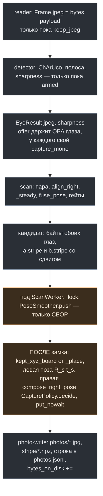
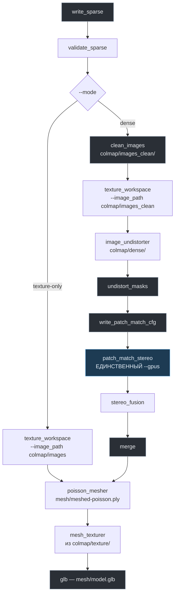

# Фотограмметрический проход: снимки с позами, снятие полосы, COLMAP

Разбор того, какие фотографии снимает `orbiter_native` рядом со сканом, что
кладётся в сессию, и что делает с этим офлайновая цепочка `orbiter-recon` —
до `mesh/model.glb`.

Документ описывает код в `native/orbiter_native/` по состоянию на коммит
`30e9d6d`. Все константы ниже выписаны из исходников и docstring'ов тестов, а
не из плана; там, где план и код расходятся, прав код. Пояснения по-русски,
идентификаторы, имена модулей, констант, шагов и флагов — как в коде.

Дополняющее чтение: `native/docs/PIPELINE.md` (откуда берётся облако),
`native/docs/ERROR_BUDGET.md` (чего стоит одна точка), `native/README.md`
(почему принято именно так) и `native/BACKLOG.md` (что дальше).

**Одно уточнение вперёд.** У COLMAP нет входа «стартовая сетка». Его плотный
этап (`patch_match_stereo`) принимает разреженную модель и снимки, и больше
ничего. Наше лазерное облако делает четыре других вещи: **является**
разреженной моделью (`points3D.txt` с треками), **выбирает** снимки,
**является** сеткой (Poisson по лазеру — это Milestone 1 целиком) и служит
**эталоном**, против которого плотное облако меряется в `merge`.

---

## 1. Что снимается и почему

### 1.1 Байты камеры, а не пересжатие

На `Frame` удерживаются **собственные JPEG-байты камеры**
(`source.MjpegReader`, флаг `keep_jpeg`, по умолчанию выключен). Это тот же
кадр, на котором решена поза, в сыром сенсорном кадре, в том разрешении, в
котором решались интринсики. Цена — один `bytes(payload)` (~26 мкс) в
reader-потоке, и только пока «take photos» включена; обычный скан не платит
ничего.

Альтернативы отвергнуты по существу: `GET /snapshot/{cam}` вернул бы **другой**
кадр без `X-Capture-Monotonic` (поза оказалась бы от соседнего момента), а
скачивание `rgb_gpu` с последующим `cv2.imencode` — это 6 МБ device→host плюс
~10 мс кодирования на детекторном потоке, и лишнее поколение сжатия. Через
цепочку всё равно проходит одно пересжатие — `image_undistorter` перекодирует
каждый снимок, который копирует (`--jpeg_quality`), — так что беречь надо
именно первое поколение.

### 1.2 Поза: левый глаз берёт сглаженную, правый — составленную через пару

`PoseFix` в `scanworker` — это board→**left**. Левому снимку кладётся сама
сглаженная поза `(R_s, t_s)`; правому — `stereo.compose_right_pose(R_s, t_s,
rig.geom)`, то есть доска в кадре **правой** камеры. В манифесте это видно по
`pose_composed`: `false` слева, `true` справа. Одна поза, записанная в оба
снимка, была бы ошибочна ровно на базу пары (145 мм на этом риге) — COLMAP
принял бы такую модель молча.

`CAMERA_ID` в `images.txt` — `1` для левых снимков, `2` для правых.

### 1.3 Гейт неподвижности — это лицензия на rolling shutter

Сенсоры строчные: снимок экспонируется строка за строкой, а COLMAP получает
**одну** позу на изображение и считает, что она верна для каждой строки. Гейт
`0.5 мм / 0.1°` по последним пяти позам — это и есть то допущение, а не
эвристика резкости (резкость меряется отдельно, ниже). Об этом прямо сказано в
docstring `photos.CapturePolicy`.

Из той же строчности растёт записанная асимметрия: `_process` переписывает
выровненный правый вход на момент левого, поэтому правый снимок может отстоять
от момента позы на `PAIR_WINDOW_S` = 20 мс. При 0.5 мм / 0.1° это меньше
0.02 мм движения; асимметрия принята сознательно и записана как
`capture_mono` (собственный момент снимка) против `pair_capture_mono`.

### 1.4 Пороги решения (`photos.CapturePolicy`)

Решение — чистая функция: всё, на что она смотрит, передано аргументами,
между вызовами ничего не помнится, из `scanworker` не импортируется ничего
(это замкнуло бы цикл импорта). Возвращает `None`, когда сторона стоит файла,
и иначе — причину словами.

| Константа | Значение | Что отбрасывает |
|---|---|---|
| `STILL_MM` / `STILL_DEG` | `0.5` / `0.1` | движение: разброс по последним позам |
| `STILL_HISTORY` | `5` | окно неподвижности (~1/6 с при 30 fps); пока поз меньше пяти — не снимаем |
| `MIN_POSE_CORNERS` | `12` | одноглазая поза с меньшим числом углов |
| `POSE_GAP_MAX_DEG` / `POSE_GAP_MAX_MM` | `2.0` / `15.0` | кадр, где собственные позы глаз расходятся сильнее |
| `NOVELTY_MM` / `NOVELTY_DEG` | `20.0` / `8.0` | ракурс, уже снятый на **этой** стороне: близко И по положению, И по направлению взгляда |
| `MIN_INTERVAL_S` | `0.5` | два снимка одной стороны ближе полусекунды |
| `SHARPNESS_FRAC` | `0.7` | кадр мягче 0.7 бегущей медианы того, что предлагает сам прогон |
| `SHARPNESS_WINDOW` / `SHARPNESS_MIN_SAMPLES` | `30` / `10` | окно медианы; меньше десяти образцов — гейт молчит |
| `QUEUE_DEPTH` | `32` | очередь писателя; переполнение выбрасывает **самый старый** и считает его |

Резкость относительная, а не абсолютная: дисперсия лапласиана зависит от
фактуры предмета, и никакое фиксированное число не переносится между
объектами.

Дублирование `STILL_MM`/`STILL_DEG` из `scanworker.py:83-84` намеренное:
`photos` обязан лежать в графе импортов **под** `scanworker`, а `_still` там
попарный, а не по окну.

### 1.5 Где решение принимается



Оранжевым — то, что связано с замком скана. Решение принимается **вне**
`ScanWorker._lock`: `offer` берёт тот же замок с обоих детекторных потоков по
40-60 результатов в секунду, и сравнение резкости с проверкой новизны против
всех уже снятых кадров под ним застопорило бы оба глаза на каждой паре. Под
замком — только сбор эмиссий смузера; решение и постановка в очередь — после.
Так же устроены все три места сброса смузера: `_process`, `set_active` и
`clear()`.

Очередь писателя — `put_nowait` с выбрасыванием самого старого: остановленный
диск не должен становиться остановленной камерой.

---

## 2. Директория сессии

Корень — `~/.orbiter-native/sessions/`, переопределяется
`ORBITER_SESSIONS_DIR`. Имя сессии — локальный момент старта,
`%Y%m%d-%H%M%S`.

```
<sessions root>/20260907-051417/
  session.json            снимок рига + мета; при реконструкции добавляется блок reconstruct
  photos.jsonl            одна JSON-строка на снимок, дописывается потоком писателя
  photos/left_0001.jpg    собственные байты камеры, сырой сенсорный кадр, нетронуты
  photos/right_0001.jpg
  stripe/left_0001.npz    StripePixels этого кадра + его кадровые точки в BOARD мм + pass_id
  clean/left_0001.png     архивная копия после инпейнта, PNG без потерь          [M2]
  laser.ply               уверенное облако на момент реконструкции, кадр доски, мм
  colmap/
    images/               по файлу на ВЫБРАННЫЙ снимок, имя = NAME в images.txt,
                          ВЕРБАТИМ в обоих режимах, никогда не переписывается
    images_clean/         те же NAME с закрашенной полосой                        [M2]
    _masks_raw/<name>.png маски полосы в сыром кадре, кэш от clean_images          [M2]
    texture_images.txt    список снимков, из которых собирается texture-воркспейс
    sparse/{cameras,images,points3D,rigs,frames}.txt
    texture/              воркспейс, который читает mesh_texturer — ВСЕГДА, в обоих режимах
    dense/                                                                        [M2]
      sparse/             БИНАРНАЯ модель от image_undistorter (cameras.bin, images.bin, …)
      images/             неискажённые снимки
      masks/<name>.png    единственное место масок слияния; 0 = игнорировать
      stereo/             карты глубин и нормалей, patch-match.cfg
      fused.ply  merged.ply
    _validate.ply         пишется и удаляется шагом validate_sparse
  mesh/
    meshed-poisson.ply    выход poisson_mesher, в ОБОИХ режимах — намеренно вне colmap/dense/
    mesh.ply  texture.png  model.glb
  recon.log               каждая команда и каждая строка её вывода — авторитетный файл
  recon-state.json        {mode, colmap_version, max_image_size, steps} — резюмирование
```

Каталоги создаёт не COLMAP: он пишет по заданному пути и родителей не делает.
За это отвечает `recon.DIRS_CREATED` — `write_sparse` создаёт `colmap/`,
`colmap/images/`, `colmap/sparse/`, `mesh/`; `clean_images` —
`colmap/images_clean/`, `colmap/_masks_raw/`, `clean/`; `texture_workspace` —
`colmap/texture/`; `image_undistorter` — `colmap/dense/`; `undistort_masks` —
`colmap/dense/masks/`.

### 2.1 `colmap/images/` против `colmap/images_clean/`

Это **два разных каталога, а не один переписанный на месте**, и разница
принципиальная.

| Каталог | Кто пишет | Что внутри | Кто читает |
|---|---|---|---|
| `colmap/images/` | `write_sparse`, **оба режима** | по одной **вербатим**-копии на выбранный снимок — с полосой и всем прочим; **после этого не переписывается никогда** | `texture_workspace` в режиме `texture-only`; `clean_images` как свой вход |
| `colmap/images_clean/` | `clean_images`, **только M2** | те же NAME: лазерные снимки после инпейнта (JPEG q95), снимки чистого прохода скопированы без изменений | `texture_workspace` **и** `image_undistorter` в режиме `dense` |

Если бы `clean_images` переписывал `colmap/images/`, один путь означал бы
разные пиксели в разных режимах, и возобновлённый прогон со сменой `--mode`
читал бы то, что оставил предыдущий, — ни один шаг не смог бы это заметить.
Раздельные каталоги делают режим видимым прямо в argv (`--image_path`),
делают правило инвалидации механическим и делают `clean_images` идемпотентным.

**Проверять на полосы надо `colmap/images_clean/`.** В `colmap/images/` полоса
есть всегда и по замыслу.

### 2.2 Имена

Базовое имя файла в `colmap/images/` — **в точности `NAME`, записанный в
`images.txt`**, и это всегда `.jpg`-имя манифеста, в обоих режимах и из
любого источника. Одно это правило делает так, что маски (`<NAME>.png`, то
есть `left_0007.jpg.png`), списки изображений и переписанный cfg сходятся
строкой, без нормализации.

### 2.3 `session.json`

Пишется при старте сессии, схема `orbiter.native.photo_session.v1`. Верхний
блок — снимок рига: `board` (ChArUco), `frame` (словесное определение кадра),
`volume` (`height_mm 400.0`, `radius_mm 150.0`, `floor_mm 5.0` из
`scan.ScanVolume`), `eyes.{left,right}` (`camera_id`, `wh`, `intrinsics` с
`fx fy cx cy dist rms_px`), `extrinsics` (`R`, `T_mm`, `rms_px`) и `params`
— `CapturePolicy`, `SelectParams`, `MaskParams`, `CfgParams` и `MergeParams`
вербатим, чтобы прогон воспроизводился по одному файлу.

Единицы — **миллиметры везде**. COLMAP безразличен к масштабу, так что мм
проходят насквозь. Исключения по смыслу: `StereoFusion.max_depth_error` —
относительная доля, `max_reproj_error` — пиксели,
`filter_min_triangulation_angle` — градусы, `PoissonMeshing.trim` —
процентиль; в единицах сцены только `--PatchMatchStereo.depth_min/max`, и их
мы считаем в мм намеренно.

При реконструкции файл переписывается с **одним добавленным** блоком —
`reconstruct`; ничего выше не меняется. В нём: `mode`, `colmap_version`,
`started_utc`/`finished_utc`, `disk` (со свободным местом на старте, оценкой,
её входами и признаком `forced`), `selected` (`left`, `right`, `clean`,
`dropped`), `buckets` (`grid`, `covered_by_selection`, `covered_by_clean`,
`clean_coverage`, `uncovered`), `passes` (по проходу: `pass_id`, `laser_on`,
`photos`, `silhouette_score` и `ratio_to_laser_pass` там, где его есть с чем
сравнивать), `gpu`, `texture_source`, `degraded`, `warnings` и `merge`.

### 2.4 `photos.jsonl`

По объекту на строку, дописывается писателем: это дёшево и переживает падение.
Поля и единицы:

| Поле | Единица / смысл |
|---|---|
| `n`, `side`, `camera_id` | номер по своей стороне, `left`/`right`, id камеры camserver |
| `file`, `stripe` | относительные пути к JPEG и к сайдкару |
| `wh` | размер сырого сенсорного кадра, пиксели |
| `capture_mono` | **собственный** момент этого снимка, с капчур-часов |
| `pair_capture_mono` | момент позы (момент левого кадра пары) |
| `pose.q_wxyz` | Гамильтонов кватернион, **скаляр первым** — порядок `images.txt` |
| `pose.t_mm` | миллиметры |
| `pose.convention` | `board->camera, world=board` — инверсия не нужна |
| `pose_frame`, `pose_source` | в чьём кадре поза; какой глаз её дал (`left+right`, `left`, `right`) |
| `pose_composed` | `true` на каждом правом снимке (составлена через пару) |
| `pose_rms_px` | остаток решения позы, пиксели |
| `pose_gap_deg`, `pose_gap_mm` | расхождение независимых поз глаз |
| `pose_corners` | углов доски на оба глаза |
| `pose_smooth_mm` | насколько сглаживание сдвинуло позу, мм |
| `sharpness` | дисперсия лапласиана; сравнивается только с медианой прогона |
| `pass_id` | номер прохода, инкрементируется на каждом переключении «photo pass» |
| `laser_on` | лазер был включён (лазерный проход) или нет (чистый) |
| `stripe_pixels` | зажжённых пикселей полосы в кадре |
| `stripe_shifted` | `true` на правых снимках: `StripePixels` в сайдкаре — интерполированные `align_right` на момент левого |
| `kept_points` | сколько точек этот кадр положил в облако |

### 2.5 `stripe/<side>_<n>.npz`

Маскирование идёт **офлайн**, через часы после того, как кадра уже нет, и
скалярные счётчики маску не восстановят. Поэтому сайдкар несёт массивы
`StripePixels` ровно так, как они лежат в `laser.py`: `x` (int32), `y`
(int32), `w` (uint8, счёт полосы), `r` (uint8, красный канал), плюс
`kept_xyz_board` (float32 N×3, кадровые точки в кадре **доски**; форма
`(0, 3)` в режиме photo pass), `wh`, `along_x`, `pass_id` и `stripe_shifted`.
Сайдкар кладётся в очередь **вместе** с JPEG, одним элементом, — снимок и его
сайдкар не могут разойтись.

### 2.6 `recon-state.json`

`{mode, colmap_version, max_image_size, steps: {name: {done_utc, seconds}}}`.
Резюмирование читает `steps`; инвалидацию гонит **только** `mode`
(`colmap_version` и `max_image_size` записаны для чтения глазами).
Подробности — §4.4.

---

## 3. Как снимать: панель, лазерный проход, чистый проход

### 3.1 Группа PHOTOS

В `scanpanel.py`, под кнопками `Clear cloud` / `Export PLY`. Никакой четвёртой
панели: обе группы живут в корневом layout'е `ScanPanel`.

- **`take photos`** — удерживать снимок там, где риг стоит неподвижно и
  смотрит откуда ещё не смотрел, вместе с позой доски. Флажок дёргает **три**
  вызова, а не один: `EyeWorker.set_photo_capture(on)` на **обоих** глазах
  (удерживать JPEG и мерить резкость) и `ScanWorker.arm_photos(on)` (строить
  кандидатов, спрашивать `CapturePolicy`, класть в очередь). Половина
  проводки молчалива: без глаз нет байтов, без скана ничего не решается.
- **`photo pass (laser off)`** — снимать не сканируя. Дёргает
  `ScanWorker.set_photo_pass(on)` и **не трогает** глаза. Переключение
  начинает новый **проход** (`pass_id`): снимки по разные стороны от щелчка
  выключателя — не одно и то же свидетельство.
- Строка счётчиков: id сессии, счётчики по глазам, дропы и **размер сессии на
  диске**. Размер берётся из `PhotoSession.bytes_on_disk` — один обход
  каталога при открытии сессии, инкремент писателем на каждый файл и
  перечитывание после реконструкции. `du` на каждом тике таймера Qt по
  каталогу с тысячами файлов — не вариант.

В режиме photo pass `ScanFrame` не строится вовсе: `scan_frame`,
присвоение `sync_gap_ms`/`sync_note` и цветовой блок `sample_beside` не
выполняются, `frame is None`, а `_place` и `_bank` выходят рано. Переключатель
— именно `self._photo_pass`, а не отсутствие полосы.

### 3.2 Группа RECONSTRUCT

Одна строка: комбо режима (`texture-only` | `dense`), кнопка
`Reconstruct`/`Abort` (одна и та же кнопка, так что живого `Reconstruct`
рядом с живым `Abort` не бывает), кнопка `Open folder`, и **одна** строка
статуса — текущий шаг и последняя строка лога, через ` · `.

Строки лога приезжают списком «накопить и обменять», который вычёрпывает
`QTimer`. `worker.Latest` — почтовый ящик на одно сообщение с перезаписью
(правильный для объекта состояния, как в `calibpanel`) и неправильный для
потока строк: он бы терял почти всё. **Авторитетен `recon.log`.**

### 3.3 Лазерный проход и чистый проход

Лазер переключается **только физически**, выключателем; программного
управления в этой работе нет и не предполагалось (см. §12 и BACKLOG).

1. **Лазерный проход.** `Clear cloud` → новая сессия, `pass 0`, размер ~0.
   Включить `take photos`, включить `scanning`, отсканировать один полный
   оборот как обычно. Ожидается: облако растёт как раньше, счётчики снимков
   доходят до ~30-80 на глаз, `dropped` остаётся 0, размер ползёт вверх, fps
   детекторов не проседает больше чем на 1-2 Гц.
2. **Чистый проход.** Выключить лазер выключателем. Снять `scanning`,
   поставить `photo pass (laser off)` — это переводит на `pass 1`. Повернуть
   ещё раз, **на полный оборот**. Ожидается ещё 30-80 снимков на глаз с
   `laser_on: false`.

**Почему «на полный оборот» — не формальность.** Гейт чистого набора спрашивает
не сколько снимков, а **откуда они смотрят**: направления взгляда бинуются в
сетку 24 × 3 (`SelectParams.buckets` — 24 азимутальных корзины по 15° и три
полосы возвышения) вокруг оси `ScanVolume`, и чистые снимки должны покрыть
**≥ 80 %** тех корзин, которые покрывает **выборка** (`views.buckets(session,
selection)`). Именно выборка, а не объект: корзина, которую вообще никто не
снимал, — не провал чистого прохода, и гейт не смеет её так засчитывать.

Корзины — мера **покрытия** и не заменяют правило новизны: 15°-корзина
намеренно грубее порога 8° / 20 мм, чтобы «покрыто» означало «оттуда примерно
кто-то смотрит», а не «оттуда смотрит ровно один».

**Перекладывание предмета между проходами.** Щелчок выключателя может сдвинуть
предмет относительно доски, а выбор видов чистые снимки **предпочитает** — то
есть порча пришлась бы ровно туда, где план уверен сильнее всего. Поэтому на
`write_sparse` силуэт лазерного облака проецируется в 5 снимков каждого
прохода и оценивается средним модулем градиента вдоль границы; проход,
набравший меньше `0.6×` от лазерного, получает предупреждение в логе и в
`session.json`. Это предупреждение, а не отказ: у оператора может быть причина,
и отказать в часе работы по эвристике хуже, чем сказать.

---

## 4. Как запустить: `orbiter-recon`

Консольный скрипт из `[project.scripts]`; сам чейн живёт в `recon.run`, а
`reconcli` владеет именами аргументов, потоком строк в stdout и кодом выхода.
Кодов три, и они значат разное: **0** — цепочка закончилась, **1** — шаг
запустился и упал, **2** — отказ, с которым оператор может что-то сделать до
того, как что-то начнётся.

### 4.1 `--check` — что спросить до всего

```
orbiter-recon --check --mode texture-only
orbiter-recon --check --mode dense --session ~/.orbiter-native/sessions/20260907-051417
```

По строке на вопрос, в том порядке, в котором ответы гейтят друг друга: без
Docker вопросы, которые задаются внутри образа, задать нельзя вообще.

| Строка | Что спрашивается |
|---|---|
| `docker` | демон отвечает |
| `image` | образ на месте (`ORBITER_COLMAP_IMAGE`, по умолчанию `colmap/colmap:latest`) |
| `colmap` | версия из `colmap -h`; **ожидается 4.2.0**, иначе предупреждение — это первое, на что думать, если шаг отверг опцию |
| `gpu` | только при `--mode dense`: `docker run --rm --gpus all <image> nvidia-smi -L`. В `texture-only` **пропускается** со словами «ни один шаг не получает `--gpus`» |
| `user` | `id -u` внутри образа: том JIT-кэша пишется, только если пользователь контейнера может в него писать |
| `mount` | bind-mount сессии. **Без `--session` пропускается и говорит об этом** — доказать отображение пути можно только на настоящем каталоге |
| `local` | `ORBITER_COLMAP`, если он задан; поиска по PATH нет нигде |
| `disk` | свободное место там, куда прогон будет писать, против того, сколько этот режим хочет |

Ничего дольше секунды `--check` не запускает. Одного он намеренно **не**
утверждает: побежит ли PatchMatch на RTX 5060 Ti (§9).

### 4.2 Milestone 1 — `--mode texture-only`

```
orbiter-recon --session ~/.orbiter-native/sessions/20260907-051417 --mode texture-only
```

Шесть шагов: `write_sparse` → `validate_sparse` → `texture_workspace` →
`poisson_mesher` → `mesh_texturer` → `glb`. **Минуты, а не час.** Ни одна
команда не несёт `--gpus`, том JIT не монтируется, `nvidia-smi -L` не
запускается: машина без GPU, без nvidia-рантайма или со сломанным — этот
прогон проходит. Порог диска — плоский **1 ГиБ**: карт глубин здесь не
пишется, масштабировать нечего.

Это сетка Poisson по **лазерному** облаку, покрашенная фотографиями. Полный
результат сам по себе — и заодно единственное, что доказывает то, что может
доказать только настоящий COLMAP: что он принимает нашу рукописную модель.

### 4.3 Milestone 2 — `--mode dense`

Те же шесть плюс семь: `clean_images` (**до** `texture_workspace`),
`image_undistorter`, `undistort_masks`, `write_patch_match_cfg`,
`patch_match_stereo`, `stereo_fusion`, `merge`. Канонический порядок —
`recon.CANONICAL_STEPS`, тринадцать имён, и это единственное место, где он
записан.

`patch_match_stereo` — **единственная** команда, получающая GPU:
`--gpus device=GPU-<uuid>` плюс том JIT-кэша (`-v <том>:/jitcache -e
CUDA_CACHE_PATH=/jitcache -e CUDA_CACHE_MAXSIZE=1073741824`). Карта выбирается
по личности, а не по слоту: `nvidia-smi -L` даёт `GPU N: <имя> (UUID:
GPU-<uuid>)`, основной становится первая запись, совпавшая с
`ORBITER_COLMAP_GPU` (UUID или подстрока имени без учёта регистра, по
умолчанию `5060`); если не совпало ничего — запись 0, и лог это говорит.
Запасной — первая запись с другим UUID, или **никакой**, если карта одна.
`--gpus all` вместе с `CUDA_DEVICE_ORDER=PCI_BUS_ID` **не** делает 5060 Ti
устройством 0 — порядок решают слоты.

**Откат — ровно один, и он стирает за собой.** Ненулевой выход, чей хвост
(последние `FAILURE_TAIL_LINES` = 500 строк) совпал с `no kernel image|invalid
device function`, — это **отсутствие ядра**; совпавший с `out of memory` —
**OOM**. Ловушка `CUDA error` намеренно **не** используется: она накрывает оба
случая, а повторять OOM без изменений — не откат. Всё остальное не
перезапускается вовсе.

Откат: удаляет `colmap/dense/` целиком, вычищает из `recon-state.json`
`image_undistorter`, `undistort_masks`, `write_patch_match_cfg`,
`patch_match_stereo`, `stereo_fusion`, `merge` (`FALLBACK_CLEARS`), заново
прогоняет `image_undistorter`, `undistort_masks`, `write_patch_match_cfg`
(`FALLBACK_RERUNS`) при `--max_image_size 1000` и повторяет PatchMatch — на
запасной карте, если она есть. **Не более одного раза.** Вне вычищаемого
множества намеренно: `clean_images` (его выход не зависит от карты и дорог в
пересборке), `texture_workspace`, `write_sparse`, `validate_sparse`,
`colmap/images/`, `colmap/images_clean/` и `mesh/`.

При одной карте: **OOM** всё равно повторяется один раз на той же карте на
меньшем размере (для того меньший размер и нужен); **отсутствие ядра**
обрывает прогон сразу, называя `native/docker/colmap-cuda128` как починку —
повторять то же отсутствующее ядро на той же карте бессмысленно. Обе причины
пишут свою строку в лог, и `session.json` записывает, какая карта работала и
был ли откат.

### 4.4 Диапазон шагов, резюмирование и смена режима

| Флаг | Что делает |
|---|---|
| `--from STEP` | начать с этого шага, выполнив его, даже если он был закончен |
| `--to STEP` | остановиться после этого шага |
| `--only STEP` | выполнить только его |
| `--restart` | стереть файл состояния: всё выполняется заново |
| `--force` | запуститься, даже когда свободного места меньше оценки |
| `--max-image-size N` | предел `image_undistorter` в dense (по умолчанию 1600) |
| `--dry-run` | напечатать командную строку каждой инвокации COLMAP; контейнер не запускается, **под сессией ничего не пишется** |
| `--list-steps` | напечатать цепочку каждого режима и выйти |

`--from/--to/--only` обязаны называть шаг **выбранного режима**, иначе —
именованный отказ, перечисляющий цепочку этого режима. Так,
`--mode texture-only --to patch_match_stereo` отказ, а не тишина.

`--dry-run` работает на зеркале сессии во временном каталоге: цепочка через
`FakeBackend` всё равно выполняет свои хостовые шаги (оттуда и берётся argv), а
они пишут модель, состояние и лог. Файл состояния, утверждающий, что
`validate_sparse` закончен, написанный прогоном, который ничего не
валидировал, — худший из возможных исходов, поэтому всё происходит в другом
месте и выбрасывается. Показывается **вся** цепочка, а не резюмирование:
зеркало несёт входы сессии и ни одного её выхода.

**Смена `--mode` инвалидирует `texture_workspace` и всё после него — в обе
стороны.** `texture_workspace` — первый шаг, чей **входной каталог** зависит
от режима (`MODE_IMAGE_PATH`: `colmap/images_clean` в dense,
`colmap/images` в texture-only), поэтому ничего после него переиспользовать
нельзя. `write_sparse` и `validate_sparse` от режима не зависят и
**выживают**. `clean_images` своего правила не требует: он существует только
в dense, так что M1 → M2 запускает его впервые, а M2 → M1 вычёркивает его из
цепочки целиком. Лог говорит это по именам:

```
mode changed texture-only -> dense: invalidating texture_workspace and the 9 steps after it (…)
```

В dense-режиме `--from image_undistorter` — **именованный отказ**, пока
`recon-state.json` не запишет `clean_images` законченным:
`colmap/images_clean/` — это выход того шага, и недисторшн читает именно его.

---

## 5. Цепочка: что делает каждый шаг и какую ручку крутить

| # | Шаг | Где идёт | Что делает |
|---|---|---|---|
| 1 | `write_sparse` | хост | читает `laser.ply` и сессию; пишет весь текстовый модель-набор, вербатим-копии в `colmap/images/` и `texture_images.txt`; решает `texture_source`, проверяет проходы, считает оценку диска |
| 2 | `validate_sparse` | контейнер | `colmap model_converter` → `colmap/_validate.ply`; **обрывает прогон** на ненулевом выходе, файл удаляется при успехе |
| 3 | `clean_images` [M2] | хост | маска + инпейнт по выбранным лазерным снимкам → `colmap/images_clean/`, кэш масок → `colmap/_masks_raw/`, архив → `clean/` |
| 4 | `texture_workspace` | контейнер | `image_undistorter --image_list_path` → `colmap/texture/`, затем **пост-условие** |
| 5 | `image_undistorter` [M2] | контейнер | `colmap/images_clean/` → `colmap/dense/` при `--max_image_size` прогона |
| 6 | `undistort_masks` [M2] | хост | по маске на **выбранный** снимок: полоса ∪ всё вне силуэта лазера |
| 7 | `write_patch_match_cfg` [M2] | хост | переписать строки источников в cfg, написанном недисторшном |
| 8 | `patch_match_stereo` [M2] | контейнер, **GPU** | карты глубин и нормалей; ленивый зонд GPU, перепроверка диска, откат |
| 9 | `stereo_fusion` [M2] | контейнер | `colmap/dense/fused.ply` через маски |
| 10 | `merge` [M2] | хост | кроп по `ScanVolume`, латеральная опора, знаковые остатки, гейты → `merged.ply` |
| 11 | `poisson_mesher` | контейнер | `mesh/meshed-poisson.ply` — из `laser.ply` [M1] или `merged.ply` [M2] |
| 12 | `mesh_texturer` | контейнер | `mesh/mesh.ply` + `mesh/texture.png`, **всегда** из `colmap/texture/` |
| 13 | `glb` | хост, trimesh | `mesh/model.glb` |



Синим — единственный шаг, который просит карту.

### 5.1 `write_sparse` — единственный, кто читает сессию

И единственный, кто пишет `colmap/images/`. Здесь же отказывает всё, что
вообще может отказать, — до того, как стартует хоть один контейнер: `laser.ply`
на месте нет (его экспортирует приложение при нажатии `Reconstruct`; CLI
ожидает найти его готовым), облако тоньше `MIN_CONFIDENT_POINTS` = 1000
уверенных точек, выборка меньше `MIN_SELECTED_PHOTOS` = 20 снимков, диск, на
который результат не влезет, смешанные разрешения на одной стороне.

`laser.ply` шаг **читает**, а не создаёт, — с одним исключением: если файл
пришёл **без нормалей**, шаг считает PCA-нормали, ориентирует их на ближайшую
**выбранную** камеру и **переписывает** файл, потому что Poisson без
ориентированных нормалей не определён. Строка лога это говорит. Если нормали в
файле были, они сохраняются как есть.

Модель:

- **`cameras.txt`** — ровно две записи, по одной на глаз.
  `OPENCV W H fx fy cx cy k1 k2 p1 p2`, когда `k3 == 0` (случай живого рига:
  `intrinsics.py` решает с `cv2.CALIB_FIX_K3`); иначе `FULL_OPENCV`. `W, H` —
  **сырой сенсорный размер**, на котором решались интринсики.
- **`images.txt`** — `IMAGE_ID QW QX QY QZ TX TY TZ CAMERA_ID NAME`, world→camera,
  что **в точности** наша хранимая board→camera `(R, t)`: инверсия не нужна.
  Гамильтон, **скаляр первым** — `Rotation.as_quat()` по умолчанию отдаёт
  скаляр последним, и это классическая ошибка, у которой есть свой тест.
  Плюс `POINTS2D[]` как `(X, Y, POINT3D_ID)`.
- **`points3D.txt`** — `POINT3D_ID X Y Z R G B ERROR TRACK[]`. Семенное
  облако **воксельно прорежено до `SelectParams.seed_cap` = 30 000 точек**
  до построения треков: без предела миллион вокселей по десяткам треков —
  многогигабайтный ASCII, который `image_undistorter` обязан разобрать и
  переписать; с пределом диапазоны глубин не страдают, потому что им нужно
  покрытие, а не плотность. Записываются только точки с треком длины ≥ 2, и
  **`POINTS2D` порождается из того же списка треков в том же проходе**, так
  что висячих наблюдений и записей `POINT3D_ID = -1` не бывает в принципе.
  Цвета из облака, `128/128/128` для бесцветного; `ERROR` — заглушка `1.0`.
- **`rigs.txt` / `frames.txt`** — один риг на камеру (`1 1 CAMERA 1` и
  `2 1 CAMERA 2`) и один фрейм на снимок. У однодатчикового рига опорный
  сенсор — сама камера и смещения нет, поэтому `RIG_FROM_WORLD` побайтно
  совпадает с позой, уже записанной для этого снимка в `images.txt` — это и
  проверяет золотой тест, так что разойтись эти два файла не могут.

Топология с **двумя** ригами — допущение, а не проверенный факт: соседний
конвертер `sfm_priors_to_colmap.py` доказывает только колонки, а гоняет одну
камеру на моторизованной орбите. Проверка — `validate_sparse`; если он
двухриговую модель отвергнет, документированное продолжение — модель
**один риг, два сенсора** (правому сенсору задаётся фиксированное смещение),
и это правка только в `colmapio`.

### 5.2 `validate_sparse` — пять секунд против часа

`colmap model_converter --output_type PLY` по `colmap/sparse`. Единственное в
цепочке, что может сказать, читает ли COLMAP нашу топологию `rigs.txt` /
`frames.txt`. PLY — дымовой тест, а не артефакт, поэтому при успехе он
удаляется.

**Ручка:** её тут нет. Ненулевой выход — это дефект модели, и он читается по
строкам выше в `recon.log`.

### 5.3 `texture_workspace` — и почему у него есть пост-условие

```
image_undistorter --image_path  <colmap/images | colmap/images_clean>
                  --input_path  colmap/sparse
                  --output_path colmap/texture
                  --image_list_path colmap/texture_images.txt
                  --output_type COLMAP --max_image_size -1
```

Вход — **полная, уже валидированная** модель; ограничивает её
`--image_list_path`. Урезанная разреженная модель не пишется, поэтому проблемы
висячих треков не существует. `--max_image_size` здесь `-1` (без предела)
намеренно: атлас — это и есть результат, и он один.

`--image_path` — **единственный** аргумент во всей M1-цепочке, зависящий от
режима, и именно поэтому смена `--mode` инвалидирует этот шаг и всё после
него.

`mesh_texturer` не имеет ни флага изображений, ни флага списка (проверено —
весь его набор опций это `--workspace_path --input_path --output_path
--output_type` плюс девять `MeshTextureMapping.*`), так что **состав
воркспейса — единственный рычаг на атлас**, а `--image_list_path` — тот
единственный флаг, на котором держится вся история с текстурой. Воркспейс,
который тихо содержал бы все снимки, покрасил бы модель полосами, пока
`session.json` докладывал бы `texture_source: "clean"`. Поэтому сразу после
выхода контейнера шаг проверяет **обе** вещи, которые могут разойтись:

1. число файлов в `colmap/texture/images/` равно `len(texture_images.txt)`;
2. `colmapio.read_images_bin(colmap/texture/sparse/images.bin)` называет
   **ровно** этот набор — ни лишнего, ни пропущенного.

Любая из них не сошлась — шаг падает по имени. Это превращает допущение в
пятисекундную проверку на первом же прогоне M1. Документированный запасной
маршрут, если `--image_list_path` поведёт себя неожиданно, — `colmap/
texture_sparse/`: урезанная модель, чьи треки **порождены заново тем же
единственным проходом `views.tracks`** (а не отфильтрованы после), со своим
собственным `validate_sparse`. Он не строится, пока не понадобится.

### 5.4 `clean_images` — и почему он стоит именно здесь [M2]

Между `validate_sparse` и `texture_workspace`, то есть **до обоих** dense-
потребителей: и текстурного воркспейса, и dense-недисторшна. Если построить
чистые снимки внутри `undistort_masks` (как было в ранней редакции), то
PatchMatch матчился бы по сырым полосам, а деградировавший M2-воркспейс был
бы недисторшен из сырых снимков, пока `session.json` утверждал бы
`"inpainted"`.

Пишет каждый выбранный снимок в `colmap/images_clean/` под **тем же NAME** —
лазерные после инпейнта в JPEG q95, снимки чистого прохода копией без
изменений — и кэширует маски в сыром сенсорном кадре под
`colmap/_masks_raw/`, чтобы `undistort_masks` их недисторшил, а не
пересобирал. Архивная копия в `clean/` — единственное место, где закрашенные
пиксели живут без второго поколения JPEG; именно её открывают, чтобы судить,
разумно ли отработал инпейнт.

**Ручки:** `MaskParams` — §7.

### 5.5 `undistort_masks` — маска это два слагаемых [M2]

`colmap/dense/masks/<NAME>.png`, полярность COLMAP: **0 = игнорировать**.
Объединение (как «игнорировать») двух вещей:

1. **маска полосы** — сырая маска из `_masks_raw/`, недисторшенная через
   **собственный `newK` этого глаза**. Модель, которую пишет
   `image_undistorter`, **бинарная**, и камер у нас две, так что `newK`
   резолвится **на снимок** через `camera_id` из `images.bin`; левый `newK` на
   правом снимке искривил бы каждую маску, которой коснулся. У снимка чистого
   прохода кэшированной маски нет, и это слагаемое для него просто пусто;
2. **всё вне силуэта лазера** — лазерное облако проецируется в каждый
   недисторшенный снимок через его `newK` и его позу **из манифеста сессии**
   (недисторшн меняет интринсики, а не позу, поэтому авторитетен
   `photos.jsonl`, а `read_images_bin` сохраняет свою единственную работу:
   имя → `camera_id`), растеризуется дисками
   `SILHOUETTE_DISC_PX` = 8 px, замыкается `SILHOUETTE_CLOSE_PX` = 15 px и
   расширяется `SILHOUETTE_DILATE_PX` = 10 px. Замыкание сшивает точки
   прореженного облака в поверхность; расширение — это запас на позу,
   верную до миллиметра.

**Файл получает каждый выбранный снимок**, включая снимки чистого прохода —
для них это маска «только силуэт», и именно она держит стол и фон вне слияния.
Пост-условие поэтому — «число файлов **равно числу выбранных снимков**», а не
числу снимков с полосой.

Без второго слагаемого стол, задник и руки оператора — сливаемая поверхность:
они вне всякого `ScanVolume`, но `stereo_fusion` об этом не знает, и каждая
слитая там точка попадает в `dense_points` и **разбавляет `agree_frac`** —
число, по которому судят merge. `patch_match_stereo` маску **не принимает**,
так что глубины там всё равно считаются: это мера чистоты на слиянии, а не
экономия времени.

### 5.6 `write_patch_match_cfg` — источники по углам, а не по близости [M2]

Cfg приходит **от `image_undistorter`**, а не от нас: его строки изображений —
авторитетный список кадров, которые COLMAP действительно зарегистрировал, и
назвать незарегистрированный — значит обрушить весь этап до первой карты
глубины. Поэтому каждая строка изображения сохраняется вербатим, меняются
только строки источников, а изображение, для которого у хоста нет геометрии,
остаётся при своём `__auto__, 20` (двадцать — собственный дефолт
`image_undistorter --num_patch_match_src_images`). Переводы строк держатся
`\n`: COLMAP читает файл построчно, а Windows-хост не должен возвращать туда
CRLF.

Источники **бинуются по углу**: `CfgParams.buckets` — `2` из 8-15°, `3` из
15-30°, `3` из 30-45°, короткая корзина добирается ближайшими оставшимися при
жёстком полу `min_angle_deg` = 8°. «Ближайший угол первым» вместе с гейтом
новизны 20 мм / 8° выдаёт **минимальную** базу каждый раз: 20 мм на 300 мм —
это 3.8°, то есть σ глубины около миллиметра, хуже лазерного облака, ради
улучшения которого плотный этап и существует.

Строка лога говорит, сколько снимков получили корзинные источники, сколько
осталось на `__auto__` и сколько выбранных снимков недисторшн не
зарегистрировал вовсе.

### 5.7 `patch_match_stereo` — аргументы и диапазон глубин [M2]

Передаётся `--PatchMatchStereo.filter_min_triangulation_angle 3` явно, хотя в
4.2.0 это и дефолт: смысл в том, чтобы намерение пережило смену дефолта в
следующей версии. `geom_consistency true` (и, как следствие,
`--input_type geometric` на слиянии) — примерно вдвое дольше за заметно
чистые карты глубин; откатывается одним флагом.

**Диапазон глубин по умолчанию не передаётся вовсе.** COLMAP выводит
`depth_min`/`depth_max` **на снимок** из 3D-точек, которые тот наблюдает, и
глобальная пара не может быть лучше. Утверждение «явные `depth_min/max`
перекрывают выведенный из треков диапазон» — допущение, а не факт: соседний
конвейер их никогда не передаёт, и контроллер 4.2.0 мы не читали. Поэтому:
после `write_sparse` считаются наблюдения на снимок, и **только** если больше
`CfgParams.thin_frac` = 10 % выбранных снимков наблюдают меньше
`min_observations` = 50 точек — в лог идёт предупреждение и передаётся
глобальный диапазон, выведенный из объёма и раздутый на `pad` = 20 %.
`session.json` записывает, **подействовал** ли явный диапазон.

**Первая ручка, если диапазон разочаровал, — не сам диапазон, а
`SelectParams.seed_cap` (30 000):** тонкие треки означают, что покрытия
семенами не хватило.

### 5.8 `stereo_fusion` [M2]

`--StereoFusion.max_reproj_error 3.0` (пиксели),
`--max_depth_error 0.015` (**относительная доля**, не мм),
`--min_num_pixels 4`, `--input_type geometric`.

`--StereoFusion.mask_path` передаётся **только если маски есть**, а не на
пустой каталог: COLMAP ищет маску по имени, и отсутствие маски значит «слить
всё», так что пустой каталог масок и несозданный каталог масок для него одно и
то же. Разница — предупреждение в логе, то есть между слитым столом, которого
никто не ждал, и слитым столом, о котором предупредили.

### 5.9 `merge` — правило словами [M2]

Оба облака зарегистрированы **по построению**: они уложены через одни и те же
позы доски, ICP не нужен. Но регистрация — не точность. Лазер несёт
субмиллиметровые точки, плотное облако — 1-2 мм и в 10-100 раз больше их, так
что невзвешенный Poisson по объединению дал бы **плотную** поверхность везде,
где есть плотная. **Лазер выигрывает.**

Три редакции подряд падали на одном случае: **плотная точка в 4 мм над
поверхностью, которую лазер покрыл полностью.** Евклидово расстояние до
ближайшего соседа не отличает «лазер покрыл эту поверхность, а точка висит над
ней» от «лазер этой области никогда не видел». Правило, которое работает,
спрашивает прямо:

1. **Кандидаты.** Шар радиуса `hypot(support_mm, max_normal_mm)` ≈ **10.44 мм**
   — наименьший шар, содержащий цилиндр опоры радиуса `support_mm` и
   полувысоты `max_normal_mm`; берутся **64 ближайших**, если пришло больше.
   Пустой шар значит, что ближайшая лазерная точка дальше 10.44 мм: точка
   **без опоры**, и правило кромки для неё сработать тоже не может.
2. **Локальный кадр.** `n` — среднее PCA-нормалей соседей, нормированное; `c`
   — их центроид.
3. **Латеральная опора.** Латеральное расстояние соседа `q` до `p` — это
   `‖(q − p) − ((q − p)·n) n‖`. Точка **опёрта**, когда не менее
   `support_min` = 5 соседей лежат в пределах `support_mm` = 3.0 мм
   латерально — **независимо от того, где они сидят вдоль `n`**. Эта оговорка
   и есть весь смысл: она позволяет узнать точку, висящую в 4 мм над покрытой
   поверхностью, чего шар радиуса `support_mm` не мог бы никогда (латеральное
   расстояние никогда не больше евклидова, поэтому такой шар делал бы
   латеральный тест тавтологией).
4. **Остаток.** `r = (p − c) · n`, **знаковый**, положительный от лазерной
   поверхности вдоль её нормали.

| Случай | Смысл | Что делаем |
|---|---|---|
| опёрта, `\|r\| ≤ max_normal_mm` (10.0) | лазер **покрыл эту поверхность**, и `p` — правдоподобное её измерение | **выбросить**; идёт в `dense_supported` — это популяция, которую меряет G1 |
| опёрта, `\|r\| > max_normal_mm` | покрытая поверхность, а точка висит над ней больше сантиметра: шум, не заполнение дыры | **выбросить** как `floater` |
| без опоры, ближайшая лазерная точка ближе `outlier_mm` (4.0) | кромка дыры: латерального покрытия нет, но лазерная поверхность кончается прямо здесь | **оставить** |
| без опоры, дальше, в плотном пятне | область, которой лазер и правда не видел: соседей в `density_mm` (1.5) не меньше `patch_frac` (0.3) × **измеренной медианы** плотности по опёртым точкам | **оставить** |
| без опоры, дальше, разреженно | floater | **выбросить** |

`dense_points = dense_supported + dense_kept + floaters` по построению.
`agree_frac` и `keep_frac` — **два разных числа**, а не одно с двух сторон:
они различаются на `floater_frac`, и печатаются оба.

**Чем правило платит, прямым текстом.** Латеральный радиус решает, насколько
широкую дыру плотному облаку разрешено заполнить. Точка посреди щели уже
примерно `2 × support_mm` (**≈ 6 мм**) всё равно имеет ≥ 5 лазерных соседей в
3.0 мм латерально — с обеих кромок сразу, — то есть **опёрта** и выброшена.
**Дыры уже ~6 мм плотное облако не заполняет никогда: лазер владеет тем, что
покрыл.** Это намеренно: 6-мм провал в субмиллиметровом облаке обычно тень,
которую облако с 1-2 мм не восстановит лучше. Выше ~6 мм правило кромки
достаёт на `outlier_mm` от края (то есть дыры примерно до 8 мм заполняются
целиком им), а середину всего, что шире, берёт правило пятна.

Симметричная цена на другом конце: точка дальше 10.44 мм **от каждой** лазерной
точки без опоры по построению, и дальше её судят кромка и пятно. На такой
дистанции правило уже не отличает «висит над покрытым» от «лазер туда не
доставал», и арбитром становится пятно — *есть ли здесь связная плотная
поверхность?*. `max_normal_mm` равен 10, а не 4, именно поэтому: чем дальше
достаёт нормальная граница, тем большая часть «висящей» популяции опознаётся и
выбрасывается, а не угадывается.

### 5.10 Гейты: два отказывают, три предупреждают

Сообщается каждый, сработал он или нет.

**G1 — регистрация (ОТКАЗЫВАЕТ).** По **опёртым** точкам, по **ячейкам**:
равные по **высоте** четверти диапазона z у `ScanVolume` (четыре фиксированные
плиты, **не** квартили по количеству — квартиль по количеству ездит вместе с
облаком, и два прогона тогда несравнимы), скрещённые с **восемью октантами
направления нормали** (знаковый рисунок компонент `n`, с `sign(x) = +` при
`x ≥ 0` — мёртвая зона в нуле, чтобы осевая грань не рассыпалась по октантам
случайно). До 32 ячеек. Ячейка гейтится, только если держит ≥ `band_min` = 500
опёртых точек; у каждой гейтящейся `|median(знакового остатка)|` обязан быть
≤ `agree_mm` = **1.5 мм**.

Медиана **знакового** остатка меряет **смещение**, поэтому просто шумное облако
(σ 1-2 мм вокруг нуля — а плотное на этих порогах выглядит именно так)
проходит, а трансляция, ошибка масштаба или поворот вокруг базовой оси
проявляются смещением и ловятся.

**Октанты — это то, что заставляет гейт работать на замкнутом предмете.**
Нормали смотрят наружу, поэтому чистая трансляция читается как **+δ с одной
стороны и −δ с другой**. Одни только z-плиты усредняют эти половины и дают
медиану около нуля — та самая непойманная разрегистрация. С разбиением по
направлению нормали половины падают в разные ячейки с **противоположными
знаками**, и обе не проходят.

`agree_mm` равен 1.5, а не 1.0, потому что сам PatchMatch несёт
субмиллиметровое систематическое смещение (база, главная точка после
недисторшна, фильтрация карт глубин), а предел жёстче собственного смещения
инструмента отказывает корректным прогонам.

Три чувствительности, которые надо знать **до** чтения чисел прогона.
Смещение, **растущее по четырём z-плитам**, — поворот или ошибка масштаба.
**Смена знака между противоположными октантами нормалей** при похожей величине
— трансляция. На кривой поверхности медиана октанта **задавлена**: у оболочки,
чьи нормали заметают квадрант, остаток равен `offset × cos θ`, так что медиана
ячейки — `offset × cos 45° ≈ 0.71 × offset`, и наименьшая равномерная
трансляция, на которой G1 откажет на цилиндре, — около `agree_mm / 0.71 ≈
2.1 мм` против самого `agree_mm` на плоскости. `p90(|residual|)` печатается
рядом с ячейками и **никогда не гейтится**: это мера шума, а не регистрации.

**G1b — популяция опоры (ОТКАЗЫВАЕТ).** Считается **до** правила пятна (чья
планка — медиана по опёртому множеству и неопределена, когда оно пусто).
Меньше `min_supported` = 2000 опёртых точек всего — измерять смещение не на
чем. Отдельное сообщение: *нет пересечения между лазерным и плотным облаком*.
Где проходит граница между двумя отказами: **равномерное смещение больше
10.44 мм** опустошает все шары и читается как «нет пересечения» у G1b, а
смещение в **4-10 мм** оставляет шары населёнными и попадает в **G1**, который
называет ячейки и знаковый рисунок — правильный диагноз вместо
дезориентирующего.

**G2 — перекрытие (ПРЕДУПРЕЖДАЕТ).** `agree_frac = dense_supported /
dense_points` (по посткроповому числу) ниже `warn_frac` = 0.25. Тёмные,
глянцевые и зеркальные предметы законно дают лазеру очень мало покрытия, и
отказ здесь отказал бы ровно тому случаю, ради которого плотный этап
существует.

**G3 — флоатеры (ПРЕДУПРЕЖДАЕТ).** `floater_frac > warn_frac` (0.25): шумное
плотное облако — сигнал качества, а не корректности.

**G4 — пол по добавке (ПРЕДУПРЕЖДАЕТ).** `keep_frac < 0.01`: *плотный этап не
добавил ничего*. Прогон не неверен, он бесполезен, и оператор должен узнать об
этом до того, как потратит ещё час.

### 5.11 Десять порогов (`scan.MergeParams`)

Один датакласс, чтобы порог нельзя было передать в одно место и не передать в
другое; пишется вербатим в `session.json`.

| Поле | Умолчание | Смысл |
|---|---|---|
| `support_mm` | `3.0` | латеральный радиус опоры; решает, насколько широкую дыру заполнит плотное |
| `support_min` | `5` | сколько лазерных соседей нужно в этом радиусе |
| `max_normal_mm` | `10.0` | как далеко вдоль нормали опёртая точка ещё измерение, а не флоатер |
| `outlier_mm` | `4.0` | кромка дыры: неопёртая точка ближе этого к ближайшей лазерной оставляется |
| `density_mm` | `1.5` | радиус, в котором меряется собственная плотность плотного облака |
| `patch_frac` | `0.3` | доля **измеренной** медианы плотности, дающая право на «пятно» |
| `agree_mm` | `1.5` | G1: наибольшая медиана знакового остатка в гейтящейся ячейке |
| `band_min` | `500` | опёртых точек, ниже которых ячейка не гейтится вовсе |
| `min_supported` | `2000` | G1b: пол по всей опёртой популяции |
| `warn_frac` | `0.25` | доля, при которой предупреждают G2 и G3 |

`candidate_radius_mm` — **не одиннадцатое поле**, а свойство
`hypot(support_mm, max_normal_mm)`: иначе его можно было бы выставить
несогласованно с двумя числами, которые его определяют. В отчёте оно
печатается, чтобы читателю не приходилось его считать.

### 5.12 Что печатает отказ, и куда бежать

Строка отчёта в `recon.log` — одна сводная, затем по строке на **каждую**
гейтящуюся ячейку (а не только на худшую: `agree_mm` — первое число, которое
крутят по реальному прогону, и крутят его именно по всей таблице):

```
merge: supported 2 489 210 of 2 914 501 (85.4%, candidate radius 10.44 mm), 21 of 32 cells gated,
  worst z4:+-+ +0.34 mm (limit 1.5), p90 |res| 1.94 mm, kept 393 118 (13.5%, kept median 4.11 mm),
  floaters 32 173
  z4:+-+  +0.34 mm over 122 863 points (z 301-400 mm)
  …
```

Отказ по G1 начинается словами `merge refused: the clouds disagree by …` и
называет ячейку, диапазон z, октант нормалей, все не прошедшие ячейки, затем —
разбор («противоположные октанты, расходящиеся **по знаку** при похожей
величине, — это трансляция; смещение, растущее по z-плитам, — поворот или
ошибка масштаба; ни то ни другое не шум»), затем — что оба облака целы, и
выход. Отказ по G1b начинается словами `merge refused: no overlap between the
laser cloud and the dense cloud` и говорит, что равномерное смещение больше
10.4 мм выглядит **ровно так**, а 4-10 мм — нет.

**Выход — `--mode texture-only`, а не `--to poisson_mesher`.** В dense-режиме
`merge` идёт в цепочке **перед** `poisson_mesher`, так что `--to
poisson_mesher` прогнал бы merge заново и отказал бы заново. Это записано в
самом тексте сообщения, а не только в документации.

**Отчёт пишется до того, как поднимается отказ.** Числа отказавшего merge — его
единственный смысл ровно в той же мере, что и у прошедшего, и `session.json`,
который бы их потерял, оставил бы оператора без того, по чему настраивать.

### 5.13 `poisson_mesher`, `mesh_texturer`, `glb`

`poisson_mesher --output_path mesh/meshed-poisson.ply` в **обоих** режимах,
намеренно **вне** `colmap/dense/`: то дерево принадлежит Milestone 2 и
удаляется откатом GPU целиком, так что сетка там была бы либо невозможна в
texture-only, либо разрушима в dense. `--PoissonMeshing.trim` = **7** против
дефолта 10, который в соседнем репозитории срезал ~85 % предмета.

**Ручка, если сетка обрезана:** `poisson_trim`. **Если сетка «раздута» или
шумна:** это `PoissonMeshing.depth` (дефолт 13) — но раньше стоит посмотреть на
нормали и на `merge`.

`mesh_texturer --workspace_path colmap/texture` — всегда этот воркспейс.
`--output_type` оставлен на дефолте `BIN`, поэтому шаг `glb` читает
**бинарный** текстурированный PLY. Наши значения: `texture_scale_factor 1`,
`atlas_patch_padding` **4** (а не дефолт 2: звон q95-JPEG переходит через
двухпиксельную канавку), `inpaint_radius 5`, `min_visible_vertices 3`,
`apply_color_correction 1`.

**Ручка для «косых» видов:** `MeshTextureMapping.min_cos_normal_angle`
(дефолт 0.1) — это порог по косинусу между нормалью грани и направлением на
камеру; поднять, если атлас берёт цвет со скользящих ракурсов и мажет.

`glb` — на хосте, через trimesh: COLMAP пишет `binary_little_endian` PLY с
**пофейсными** `texcoord` и сайдкар-PNG, названный в строке
`comment TextureFile`. Почти ничто это не открывает чисто (импортёр PLY в
Blender теряет пофейсные UV, и модель грузится без текстуры), а GLB — один
самодостаточный файл. Шаг **best effort**: падение здесь оставляет `mesh.ply`
и `texture.png` на диске и пишет предупреждение; терять час реконструкции
из-за библиотеки упаковки — плохая сделка.

---

## 6. Текстура: `texture_source` и правило корзин

`texture_images.txt` — по имени снимка в строке, ровно как они стоят в
`images.txt`. Его содержимое и метка `texture_source` решаются на
`write_sparse`.

| Условие | Что в списке | `texture_source` | Уровень |
|---|---|---|---|
| ≥ `clean_min` (**12**) чистых снимков **и** чистые виды покрывают ≥ `clean_coverage` (**80 %**) корзин, покрытых **выборкой** | чистые снимки | `"clean"` | нормально |
| любое из условий не выполнено, **M1** | вся выборка (вербатим-снимки, с полосами) | `"raw"` | **WARNING — деградация** |
| любое из условий не выполнено, **M2** | вся выборка — а поскольку воркспейс недисторшится из `colmap/images_clean/`, лазерные снимки в нём несут **закрашенные** пиксели | `"inpainted"` | **WARNING — деградация** |

Строка M2 — **единственное названное исключение** из правила «закрашенные
пиксели не попадают в атлас». Оно принято, а не обойдено: ровно эти снимки уже
признаны годными для PatchMatch, предупреждение называет корзины, которые
чистый набор пропустил, а лекарство — добирающий чистый проход и повторный
прогон M1 — стоит минуты.

**Правило «всё или ничего» — по замыслу.** Впустить лазерные снимки тех корзин,
которых не покрыл ни один чистый, заполнило бы ровно эти дыры, но у
`mesh_texturer` нет пофайлового предпочтения: впущенный лазерный снимок может
выиграть вершины, которые видит и чистый, и полоса протечёт туда, где её никто
не предсказывал.

Предупреждение называет оба числа и корзины, свёрнутые в дуги, а не в список
пар индексов:

```
only 7 clean photos and 54% bucket coverage (18 of 33 buckets; missing az 120-180 at all
elevations) — texturing from the full set, texture_source=raw
```

**Деградировавший прогон — не «прошёл».** «Нет красного в атласе» — это зачёт
**только** когда `session.json` говорит `texture_source: "clean"` и
`degraded: []`. Ниже любого из гейтов прогон всё равно доходит до конца, атлас
собирается из полного набора, и это документированный деградировавший результат.

**Почему план предпочитает полный атлас с полосами атласу без полос, но с
дырами.** Полосу оператор видит и переснимает; дыра выглядит как провал
моделирования.

---

## 7. Снятие полосы: три слоя и детектор гребня

### 7.1 Три слоя, в порядке приоритета

**Чистый проход > инпейнт > маска.**

- **Маска одна не чинит ничего.** `stereo_fusion` принимает
  `--StereoFusion.mask_path` и его чтит, но `patch_match_stereo` **не
  принимает маски вовсе**: он считает карту глубин для каждого пикселя, и к
  моменту, когда у слияния появляется голос, полоса уже испортила каждое
  NCC-окно, которого коснулась. Маскировать — значит удалять ущерб задним
  числом.
- **Поэтому полоса закрашивается в пикселях, которые читает PatchMatch**, а
  маска остаётся второй линией — потому что инпейнт **выдумывает** фактуру, а
  выдуманная фактура сматчивается спекулятивно ничуть не хуже полосы.
- **Лучше и того и другого — снимки без полосы.** Настоящие пиксели, ничего не
  выдумано, и это же правильный источник текстуры. Цена: оператор должен
  щёлкнуть выключателем и сделать ещё оборот (§3.3).

### 7.2 Маска — это четыре вопроса, объединённых, а не один

Собственная детекция кадра (`laser.find_stripe_pixels`) — истина о том, где
скан **измерил** полосу, но она работала при `LaserParams.redness_min` = 45 и
только внутри полосы строк. К ней добавляются:

- кадровые **3D-точки, спроецированные обратно** в этот глаз — места, где
  полоса доказуемо была, сказанные в миллиметрах, а не в пикселях;
- второй проход детекции на пороге, который скан не мог бы себе позволить:
  `MaskParams.redness_min` = **15** (против 45 у скана);
- **отклик гребня**, когда он доступен, для тех вершин, которые порог рвёт на
  куски.

Скан не может опустить порог, потому что там ложное срабатывание становится
неверной 3D-точкой. Здесь ложное срабатывание стоит несколько замаскированных
пикселей из двух миллионов, а ложный **пропуск** стоит красной полосы в
атласе, — так что сделка идёт в другую сторону, и маска намеренно жадная.

| Константа (`stripemask.MaskParams`) | Значение | Смысл |
|---|---|---|
| `redness_min` | `15` | пол второго прохода по `laser.stripe_score` |
| `background_px` | `15` | сторона открытия для фона — та же, что у скана |
| `use_ridge` | `True` | участвует ли отклик гребня; numpy-референс не требует ничего кроме numpy, так что это ручка измерения, а не проверка возможностей |
| `ridge_sigma` | `ridge.SIGMA_PX` = `5.0` | собственная ширина полосы как σ гауссианы, а не второе мнение о ней |
| `ridge_min` | `0.1` | сила гребня; через q95-JPEG, чья цветовая субдискретизация уширяет полосу до счёта, это полоса с пиком около 30 — ровно в зазоре между нашим полом 15 и порогом скана 45 |
| `dilate_px` | `24` | расширение полосы, 2 × FWHM: покрывает и 8×8 блоки JPEG, и его 2×2 chroma subsampling. Полная диагональная полоса на 1080p стоит тогда ≈ 5 % кадра |
| `inpaint_px` | `3` | радиус `cv2.inpaint` |

Всё это в **сыром сенсорном кадре** — том же, в котором живут снимок,
пиксели сайдкара и хранимые интринсики. Недисторшн приходит позже и
принадлежит `recon.undistort_masks`, который недисторшит **кэшированную**
маску, а не пересобирает её против пикселей, которых уже нет.

Полярность COLMAP: **0 = игнорировать**, ненулевое = использовать. Это
проверенный факт, и он **противоположен** тому, чего хочет `cv2.inpaint`
(заполняет там, где маска ненулевая), — инверсия между ними и есть то, что
делает `build`.

### 7.3 Детектор гребня (`ridge.py`)

Скан находит полосу **по цвету**: пиксель зажжён, когда его счёт перевалил
`redness_min` = 45, а пересечение сканлайна берётся из профиля счёта. Это
работает, и на узком ненасыщенном профиле работает очень хорошо. У этого две
слепые зоны, и обе про **уровень**, а не про форму:

- **у насыщенной полосы не осталось профиля** — обрезанная на 255 вершина
  плоская, гауссиане нечего фитить, и центроид гадает по флангам;
- **у тусклой полосы нет пикселей вообще** — на тёмной или поглощающей красное
  поверхности полоса не доходит до 45, ничего не зажигается, и оценщику даже
  не предлагают сканлайн. Точка не измерена плохо — её **нет**.

Детектор гребня отвечает на оба, потому что спрашивает другое: не насколько
ярок этот пиксель, а лежит ли он на **гребне**. Счёт сглаживается гауссианой
собственной ширины полосы, гессиан берётся аналитически (через
гауссово-производные ядра — это точно, а не разность разностей), и берутся его
собственные значения: большее по модулю — кривизна поперёк линии, `−λ` —
сила гребня: положительна на светлой линии, отрицательна на тёмной, ноль на
ровном месте, при любой абсолютной яркости.

Настроечная константа одна, σ, и она не свободна: это собственная ширина
полосы. `σ = FWHM / 2.355`, живая полоса меряет FWHM ≈ 12 px, значит
`SIGMA_PX` ≈ 5. Ядра режутся на 3σ — 31 отсчёт.

**Правило поставки** (`tests/test_ridge_bench.py`): v2 включён по умолчанию,
только если он (a) снижает RMS центроида не менее чем на 20 % на насыщенном
семействе, (b) не хуже на узком, (c) возвращает не менее чем вдвое больше
сканлайнов на тусклом, и (d) стоит не больше 3 мс времени GPU на кадр 1080p.
Измерено:

| Критерий | Измерено | Требуется | Итог |
|---|---|---|---|
| (a) насыщенное, падение RMS | **71.8 %** | ≥ 20 % | ✅ |
| (b) узкое, худшее отношение RMS | **0.43** | ≤ 1.00 | ✅ |
| (c) тусклое, recall | **бесконечен** (у центроида 0 сканлайнов) | ≥ 2× | ✅ |
| (d) 1080p, время устройства | **2.89 мс** (`SHIP_RULE_D_MS`, запись 2026-09-07, RTX 5060 Ti) | ≤ 3.0 мс | ✅ |

Вердикт: `LaserParams.use_ridge` = **True**, и тест держит умолчание кода
равным вердикту измерения, чтобы они не разъехались.

Пофамильные числа (RMS в px, по всем произведённым центрам):

| Семейство | σ, пик | ridge | centroid | отношение |
|---|---|---|---|---|
| narrow | 0.80, 200 | 0.0123 | 0.0284 | 0.43 |
| narrow | 1.20, 150 | 0.0136 | 0.0362 | 0.38 |
| narrow | 1.80, 255 | 0.0077 | 0.0254 | 0.30 |
| narrow | 1.40, 120 | 0.0162 | 0.0528 | 0.31 |
| saturated | 5.10, 266 | 0.0121 | 0.0430 | 0.28 |
| dim | 5.10, 15…40 | 0.0185–0.0485 | — (0 сканлайнов) | — |

Критерий (d) — **запись**, а не замер текущего прогона: это единственный
критерий, которому вообще нужна карта, он проходит с запасом меньше 4 %, а
карту делят с остальным набором тестов и со всем, что ещё крутится на машине.
Живое число в этих последних 4 % сделало бы тест умолчания тестом загрузки
машины. Ядро всё равно тимится там, где карта есть, но как регрессионный
сторож против записи (`SHIP_RULE_D_DRIFT` = 2.0 в обе стороны), а не как
критерий.

**Гребень — путь только для GPU-пути.** numpy-референс тоже всегда доступен
(модуль обязан быть опционален ко всему остальному, и `stripemask` должен уметь
им пользоваться на машине без карты), но 0.45 с против 2.9 мс — это множитель
150, и жить референсу позволено именно как референсу.

**И выигрыш скана — это насыщенное ядро, а не тусклый recall.** Тусклый
recall, ради которого гребень главным образом и брали, скану **не достаётся**:
`scan_frame` отказывает кадру без зажжённых пикселей ещё до того, как будет
взят хоть один центр. Тусклый recall принадлежит `stripemask` — то есть маске,
а не облаку.

---

## 8. Диск

Оператор потребовал, чтобы приложение следило за диском, и оно следит в трёх
местах: группа PHOTOS показывает размер сессии живьём, `--check` докладывает
свободное место на корне сессий, и `recon.run` **отказывается** стартовать,
когда свободного меньше оценки этого режима.

**Milestone 1 — плоский порог 1 ГиБ** (`TEXTURE_ONLY_DISK_BYTES`): карт глубин
он не пишет, масштабировать нечего.

**Milestone 2 — оценка считается, а не назначается.** Стоимость плотного этапа
определяют карты глубин и нормалей, и обе масштабируются выборкой и размером
после недисторшна:

```
bytes ≈ n_selected × (W × H × 4 B) × 4 (глубина + нормаль) × 2 (фотометрический + геометрический) × 1.3
        + 1 ГиБ
```

(`BYTES_PER_SAMPLE` 4, `MAPS_PER_IMAGE` 4, `PASSES_PER_IMAGE` 2,
`DISK_SLACK_TENTHS` 13, `DISK_HEADROOM_BYTES` 1 ГиБ). Считается **дважды**: на
`write_sparse`, где `n_selected` впервые существует, и **ещё раз прямо перед
`patch_match_stereo`**, где размер после недисторшна известен точно из
`dense/sparse/cameras.bin` — вторая проверка ловит сессию, которая забилась во
время недисторшна. Оба числа и их входы уходят в `session.json`.

Плоские «12 ГБ» отвергнуты как одновременно слишком много для съёмки в 40
кадров и слишком мало для съёмки в 150.

Отказ — по имени, с лекарствами: освободить место, перенести корень через
`ORBITER_SESSIONS_DIR`, или передать `--force` (тогда та же строка уходит в
предупреждения с пометкой `Forced.`).

**После удачного прогона удаляйте `colmap/dense/stereo/`.** Это большая часть
размера сессии — карты глубин и нормалей на каждый снимок, в двух проходах, —
и они не нужны ни одному артефакту: `fused.ply`, `merged.ply`,
`mesh/meshed-poisson.ply`, `mesh/mesh.ply`, `mesh/texture.png` и
`mesh/model.glb` от них уже не зависят. Цена — что повторный `--from
patch_match_stereo` придётся считать заново.

---

## 9. sm_120: почему это не решено, и что с этим делать

Публичный `colmap/colmap:latest` на этой машине — COLMAP **4.2.0**, собранный
против CUDA 12.9.1, но его CUDA-бинарник несёт SASS только для
sm_50/60/70/75/90 плюс прямо-совместимый PTX для compute_90. **RTX 5060 Ti —
это sm_120**, которого не существовало, когда те ядра компилировались. Побежит
ли `patch_match_stereo` на ней через публичный образ вообще — зависит от того,
JIT-скомпилирует ли драйвер compute_90 PTX вперёд, на первом же запуске.
Правдоподобно, не проверено, и медленно на этом первом запуске.

Поэтому:

1. **5060 Ti пробуется первой**, по UUID, с примонтированным томом JIT-кэша,
   чтобы удачная компиляция была оплачена один раз. Внутри `--rm` без тома эта
   работа выбрасывается вместе с контейнером; окупается кэш **между
   прогонами** — резюмированием, повторной попыткой отката и следующим
   прогоном, — а не внутри одного, раз GPU просит одна-единственная команда.
2. **Ошибка ядра** — стирание воркспейса и откат на GTX 1650 SUPER при
   `max_image_size 1000` (§4.3).
3. **Ожидаемое решение — свой образ**, `native/docker/colmap-cuda128`: COLMAP
   4.2.0 из исходников с `-DCMAKE_CUDA_ARCHITECTURES="75;89;120"`, то есть с
   настоящим машинным кодом под sm_120, sm_89 (Ada) и sm_75 (запасная карта).
   Сборка — 40-60 минут фоновой работы, которую оператор запускает руками; ни
   один тест и ни один гейт CI её не вызывает. Подробности, включая точные
   пины и почему каталог назван по требованию (CUDA ≥ 12.8 — первый тулкит,
   чей `nvcc` вообще знает про sm_120), — в
   `native/docker/colmap-cuda128/README.md`. Указать на него:
   `ORBITER_COLMAP_IMAGE=orbiter/colmap:cuda129-sm120`.
4. **Третий маршрут** — локальный `colmap`, но только когда `ORBITER_COLMAP`
   именует исполняемый файл. Поиска по PATH нет нигде и никогда.

**Milestone 1 к этому не имеет отношения вовсе:** ни один его шаг не просит
карту.

---

## 10. Живой стенд

### 10.1 Прогон 1 — Milestone 1, `texture-only`

Предпосылки: camserver на `192.168.0.222:8088` поднят, сервер Orbiter на
`:8000` поднят, пара откалибрована на 1920×1080 (rms пары ≈ 0.89 px, rms K ≈
0.81/0.84 px). **Ни один шаг M1 не просит GPU** — ни одна команда не несёт
`--gpus`, nvidia-рантайм не зондируется, — так что машина без работающей карты
этот прогон должна пройти. **Это прогон и проверяет**: инициализирует ли
какой-нибудь шаг M1 CUDA внутри себя. Заранее это не утверждается.

1. `orbiter-recon --check --mode texture-only` → docker, образ, **COLMAP
   4.2.0**, `user` (`id -u`, ради тома JIT), свободное место против плоского
   порога 1 ГиБ. `gpu` **пропущен** — так и должно быть в этом режиме; `mount`
   пропущен, если не передан `--session` (передайте его, чтобы доказать
   отображение пути).
2. Запустить приложение по GPU-пути. Строка статуса должна сказать
   `GPU: NVIDIA GeForce RTX 5060 Ti (nvJPEG decode + torch stripe score)`.
3. `Clear cloud` → в группе PHOTOS свежий `session_id`, `pass 0`, размер ~0.
4. **Лазерный проход** — §3.3, пункт 1.
5. **Чистый проход** — §3.3, пункт 2.
6. Поставить режим **`texture-only`**, нажать **`Reconstruct`**. Ожидается, по
   порядку: `write_sparse`, `validate_sparse`, `texture_workspace`,
   `poisson_mesher`, `mesh_texturer`, `glb` — **минуты, не час**.
7. Артефакты:
   - `recon.log` — `validate_sparse` вышел с 0. *Настоящая цель прогона: это
     единственное доказательство, что COLMAP принимает нашу рукописную модель,
     включая `rigs.txt`/`frames.txt` и **двухриговую топологию**, которой
     соседний конвертер не демонстрирует.*
   - `recon.log` — **пост-условие `texture_workspace` прошло**: воркспейс
     держит ровно те снимки, которые назвал `texture_images.txt`. Это
     `--image_list_path`, превращающийся из допущения в факт за пять секунд.
   - `recon.log` — **инициализировал ли какой-нибудь шаг M1 CUDA.** Ни одному
     не давали `--gpus`, так что ожидаемый ответ — «ни один»; прогон
     записывает, что произошло на самом деле. «M1 проходит с выключенным
     nvidia-рантаймом» — наблюдение, которое стоит записать, если оно верно, а
     не требуемый исход.
   - `session.json` — `texture_source`, `buckets.clean_coverage`,
     `passes[].silhouette_score`, блок `disk` с входами оценки.
   - `mesh/model.glb` — открывается в Windows 3D Viewer с текстурой, и
     **красной полосы в атласе нет**.
   - **Зачёт условный, по замыслу.** «Нет красного в атласе» — это зачёт
     **только** когда `session.json` говорит `texture_source: "clean"` и
     `degraded: []`. Если чистый набор не прошёл гейт, прогон всё равно
     доходит до конца, атлас собран из сырых снимков, `texture_source` — `raw`,
     а в логе стоит WARNING; это **деградировавший результат, а не зачёт**, и
     починка — ещё один чистый проход по корзинам, которые назвало
     предупреждение.
8. Milestone 2 начинается только после чистого прогона 1.

### 10.2 Прогон 2 — Milestone 2, `dense`

Та же съёмка, режим **`dense`**; `--check` теперь считает неработающий GPU
проблемой. Дополнительно ожидаются: `clean_images` (перед текстурным
воркспейсом), `image_undistorter`, `undistort_masks`,
`write_patch_match_cfg`, `patch_match_stereo` (долгий — десятки минут),
`stereo_fusion`, `merge`.

- **В `colmap/images_clean/<лазерный снимок>.jpg` полосы нет** — *до* того, как
  побежал `image_undistorter`, — **а под тем же NAME в `colmap/images/` она
  есть**: вербатим-копия нетронута. Проверить одну пару файлов глазами.
- **Вопрос sm_120 решается в первые минуты `patch_match_stereo`**, не раньше.
  Если драйвер JIT-ит compute_90 PTX, первый запуск медленный, а том JIT
  делает быстрым **следующий прогон** (резюмирование, повторную попытку отката
  или прогон 3 — не остаток этого прогона, раз карту просит одна команда);
  если не JIT-ит — в логе `no kernel image`, воркспейс стирается, и прогон
  продолжается на GTX 1650 SUPER при `max_image_size 1000`.
- `colmap/dense/masks/*.png` — полоса чёрная, **и всё вне спроецированного
  силуэта лазера тоже** (стол, задник), предмет между ними белый; **число
  файлов равно числу выбранных снимков**, а у снимка чистого прохода маска
  силуэтная (полосы в ней нет).
- `clean/*.png` — ни красной линии, ни явного смаза.
- `colmap/dense/fused.ply` — открывается в панели Cloud («Open PLY»), лежит на
  предмете, а не под столом. С силуэтной маской стола в нём должно быть
  **заметно меньше**, чем дала бы наивная фузия.
- **`recon.log` печатает полную строку merge** и таблицу ячеек (§5.12). Именно
  это, а не «плотнее любого из входов», и есть способ судить плотный этап.
  Отказ по G1 или G1b оставляет `laser.ply` и `fused.ply` целыми и называет
  `--mode texture-only` как выход; G2/G3/G4 появляются предупреждениями, и
  прогон продолжается.
- **Таблица ячеек — вход настройки прогона 2.** `agree_mm` — первое число,
  которое двигают, если отказывают корректные на вид прогоны; `support_mm` и
  `patch_frac` — следующие, когда оставленное множество покажет, верен ли пол
  «~6 мм» для настоящих дыр на реальных предметах (§5.9); `min_supported` —
  последним.
- `session.json` записывает, **подействовал** ли явно переданный диапазон
  глубин, когда сработал откат (§5.7).
- `recon.log` называет, какая карта считала PatchMatch и был ли откат.

---

## 11. Что читать на панели и в `recon.log`

**На панели, группа PHOTOS.** `session_id` — та сессия, которую держит окно.
Счётчики по глазам должны расти вместе (правый глаз идёт ~20 fps против 30 у
левого, и снимки берутся из **пар**, так что темп задаёт правый; минимальный
интервал 0.5 с заметно выше обоих). **`dropped` обязан оставаться 0**: это
счётчик очереди писателя, и ненулевой значит, что диск не успевает за камерами.
Размер должен ползти вверх ровно.

**На панели, строка RECONSTRUCT.** Шаг и последняя строка его вывода, через
` · `. Это одна строка, а не журнал; всё остальное — в `recon.log`.

**В `recon.log`, по важности.**

| Строка | Что она вам говорит |
|---|---|
| `disk: … free, …` | оценка и то, из чего она посчитана |
| `write_sparse: texture set is N images, texture_source=…` | попал ли атлас в чистый набор — см. §6 |
| `only N clean photos and P% bucket coverage (… missing az …)` | какие корзины досняты не были: это адрес добирающего чистого прохода |
| `warning: pass N (laser off, …) scores … of the laser pass` | предмет мог сдвинуться при щелчке выключателя (§3.3) |
| `mode changed X -> Y: invalidating texture_workspace and the N steps after it` | смена режима не резюмируется, а пересчитывается с этого места (§4.4) |
| `<step>: skipped, finished <utc>` | резюмирование; чтобы прогнать заново — `--restart` или `--from` |
| `write_patch_match_cfg: N images given angle-bucketed sources, M left at __auto__, K …` | сколько снимков недисторшн не зарегистрировал (K > 0 — повод посмотреть) |
| `merge: supported … of … (…%), … cells gated, worst …` | сводка merge; дальше — по строке на гейтящуюся ячейку |
| `merge refused: …` | §5.12; выход — `--mode texture-only` |
| `glb: wrote model.glb, N.N MB` | конец цепочки |

**Как читать статистику merge.** Медианы ячеек — мера **смещения**, и только
они могут отказать. `p90 |res|` — мера **шума**, и она не гейтит ничего.
Отказ называет ячейку. **Смена знака между противоположными октантами
нормалей — это трансляция.** **Смещение, растущее по z-плитам, — это
поворот** (или ошибка масштаба). Ячейки ниже `band_min` не гейтятся и
перечисляются отдельно, в `skipped`.

---

## 12. Известные ограничения

1. **Дыры уже ~6 мм плотный этап не заполняет никогда.** Точка посреди такой
   щели опёрта с обеих кромок сразу и выбрасывается. Это следствие
   `2 × support_mm`, оно намеренное (§5.9) и настраивается только вместе с
   `patch_frac`, по реальному прогону 2.
2. **Чистый проход — действие оператора.** Программного управления лазером нет
   (он на физическом выключателе), а выдержку эти камеры игнорируют.
   Проверка согласия проходов и гейт корзин — это **аудит**, а не починка.
3. **Принципиальный преемник обоих — стробирование лазера.** Кадры «лазер
   включён» / «лазер выключен» вперемежку дают `on − off`: сцена вычитается по
   построению, полоса перестаёт делить кадр с красными проводами и бликами, а
   кадр «выключено» — это одновременно и настоящий цвет точки, и снимок без
   полосы, которого не надо ни закрашивать, ни маскировать, ни выпрашивать у
   оператора отдельным проходом. Это заменило бы и инпейнт, и ручной чистый
   проход. Требования (толчок должен попадать в вертикальное гашение, а фазу
   приходится замыкать по самим кадрам), эскиз программной ФАПЧ и цена —
   в [BACKLOG.md](../BACKLOG.md), раздел «Laser strobing».
4. **`patch_match_stereo` не экономит на маске.** Он маску не принимает, так
   что глубины считаются и для стола, и для задника; силуэтное слагаемое —
   мера **чистоты** на слиянии, а не скорости. Если время PatchMatch когда-то
   станет ограничением, ответ — кроп снимков, и это другая работа.
5. **Двухриговая топология — допущение.** Проверяется `validate_sparse`;
   документированное продолжение — модель «один риг, два сенсора» (§5.1).
6. **Окклюзия решается наполовину.** Точка попадает в трек, только если она
   перед камерой, внутри кадра **и** её PCA-нормаль смотрит на камеру
   (`n · d < 0`). Этого достаточно для диапазонов глубин и для покрытия; это не
   решатель видимости, и им не притворяется.
7. **`ERROR` в `points3D.txt` — заглушка `1.0`.** COLMAP её читает, плотный
   этап по ней не гейтит. Если окажется, что она важна, ошибка репроекции трека
   вычислима из того, что уже есть.
8. **Текстурированную сетку в GL-виде посмотреть нельзя.** `model.glb`
   открывается внешним просмотрщиком; «Open PLY» панели Cloud покрывает
   `fused.ply` и `merged.ply`. См. BACKLOG.
