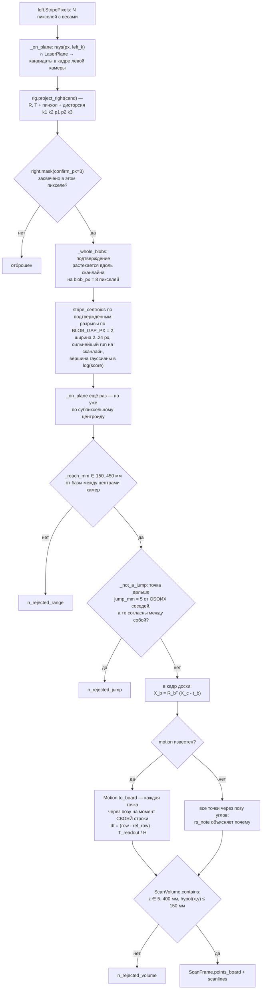
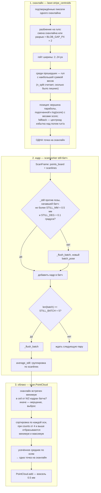
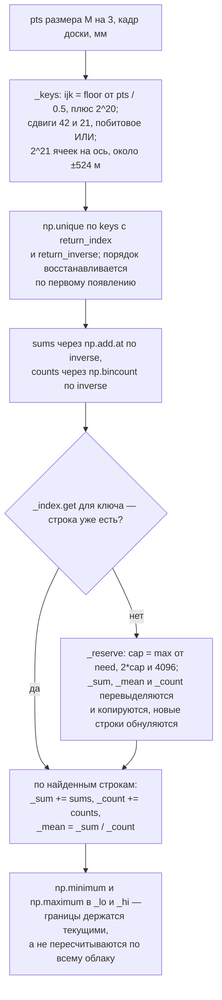
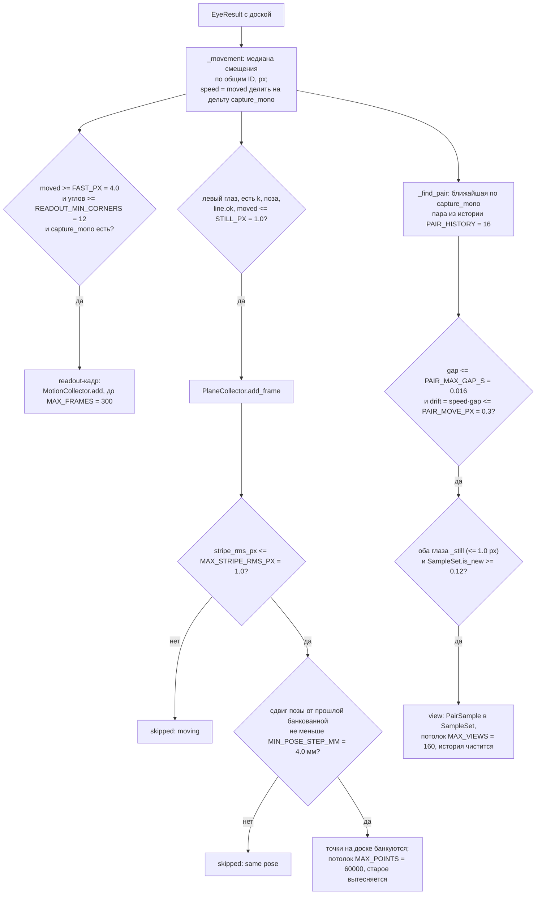

# Конвейер кадра и накопление точек

Разбор того, что происходит с одним кадром в `orbiter_native` в режиме
сканирования, и как из отдельных сканлайнов получается облако точек.

Документ описывает код в `native/orbiter_native/` по состоянию на коммит
`9a7500b`. Все константы ниже выписаны из исходников, а не из README; там, где
README и код расходятся, это отмечено. Пояснения по-русски, идентификаторы,
имена модулей, констант и функций — как в коде.

Дополняющее чтение: `native/README.md` (почему принято именно так) и
`native/BACKLOG.md` (что запланировано).

---

## 1. Кто на каком потоке

На каждый глаз запускается два потока (`worker.EyeWorker.start`), плюс один
общий поток скана и GUI-поток.

| Поток | Имя | Что делает | Где код |
|---|---|---|---|
| reader | `left-read` / `right-read` | тянет MJPEG из сокета, парсит границы и заголовки, декодирует, кладёт кадр в `Latest` | `source.MjpegReader`, `worker.EyeWorker._read_loop` |
| detector | `left-detect` / `right-detect` | берёт **новейший** кадр, ChArUco/трекинг, счёт полосы, публикация в sinks | `worker.EyeWorker._detect_loop` |
| scan | `scan` | спаривание глаз по капчур-часам, `scan_frame`, still-батчи, воксельное слияние | `scanworker.ScanWorker._loop` |
| GUI | главный | 30 Гц таймер `_PAINT_MS = 33`, рисование, проброс `stripe_rows` в воркеры | `app.MainWindow._paint` |

Между reader и detector стоит `worker.Latest` — почтовый ящик на одно
сообщение: писатель перезаписывает, читатель забирает. Очереди нет
намеренно — кадры, пришедшие во время детекции, **пропускаются**, а не
копятся. То же самое между scan-потоком и GUI (`ScanWorker.status`).

GPU (когда доступен, `gpu.available()`): nvJPEG-декод и счёт полосы
(`gpu.stripe_score`). Всё остальное — CPU. ChArUco GPU-реализации не имеет.

---

## 2. Путь одного кадра, ЛЕВЫЙ глаз, режим скана

```mermaid
flowchart TD
    subgraph READ["поток left-read"]
        direction TB
        A["HTTP chunk из httpx.Client.stream"] --> B["_demux: ищет --camserverframe<br/>и CRLF CRLF, режет по Content-Length<br/>сброс буфера при 8 MB"]
        B --> C["_parse_headers:<br/>X-Capture-Monotonic, X-Frame-Seq, X-Age-Ms"]
        C --> D{"self._gpu?"}
        D -->|нет| E1["cv2.imdecode IMREAD_COLOR<br/>затем cvtColor BGR2GRAY<br/>display = bgr"]
        D -->|да| E2["gpu.decode: torch.frombuffer + nvJPEG<br/>тензор 3 x H x W uint8 RGB на GPU"]
        E2 --> E3["gpu.to_cpu full=False<br/>скачивает gray H x W = 2.07 MB<br/>и display H/2 x W/2 x 3 = 1.56 MB<br/>bgr = None"]
        E1 --> F["Frame: bgr, gray, display, wh,<br/>capture_mono, recv_mono, rgb_gpu"]
        E3 --> F
        F --> G["Latest.put — перезапись, без очереди"]
    end

    G --> H["Latest.take timeout=0.25"]

    subgraph DET["поток left-detect"]
        direction TB
        H --> I["intrinsics = eye.intrinsics_for wh<br/>чужое разрешение отвергается"]
        I --> J["board_wanted для левого глаза = True,<br/>ChArUco в скане считается"]
        J --> K{"BoardDetector.detect:<br/>_since_detect + 1 &gt;= redetect_every = 10?"}
        K -->|нет, есть трек| L["_follow: KLT на кропе<br/>win 21, levels 3, margin 64<br/>cornerSubPix half 5<br/>гомография RANSAC 2.0 px<br/>чтение 3 маркеров через неё"]
        K -->|да| M["charuco_detect — полный проход<br/>calibration.detect_board"]
        L -->|трек не удержался| M
        L --> N["estimate_pose:<br/>&gt;= 6 углов, IPPE + приор _last_R,<br/>перевод в центрированный face-out кадр"]
        M --> N
        N --> O{"stripe_wanted left:<br/>board.R is not None?"}
        O -->|нет| P["StripePixels reason=<br/>no board pose — nothing to place"]
        O -->|да| Q{"rgb_gpu?"}
        Q -->|да| R1["gpu.stripe_pixels<br/>в полосе строк stripe_rows"]
        Q -->|нет| R2["laser.find_stripe_pixels<br/>в полосе строк stripe_rows"]
        R1 --> S["StripePixels: x, y int32,<br/>w uint8 = score, wh, along_x<br/>с GPU качается только список пикселей<br/>~17 байт на пиксель"]
        R2 --> S
        S --> T["EyeResult: display, stats, board,<br/>stripe, wh, descriptor, capture_mono"]
        P --> T
        T --> U["sinks: почтовый ящик окна + ScanWorker.offer"]
    end

    classDef gpu fill:#1d3b53,stroke:#7cc4ff,color:#e8f2ff
    classDef cpu fill:#2a2f36,stroke:#8b9aac,color:#e8eaee
    class E2,E3,R1 gpu
    class E1,L,M,N,R2 cpu
```



Синим отмечены стадии, целиком идущие на GPU.

### Что именно скачивается с GPU

`gpu.to_cpu(rgb, full)` при 1920x1080:

| буфер | размер | когда |
|---|---|---|
| `gray` (H x W uint8) | 2.07 MB | **всегда** — ChArUco хочет каждый пиксель |
| `display` (H/2 x W/2 x 3) | 1.56 MB | когда `full=False` — то есть в режиме скана |
| `bgr` (H x W x 3) | 6.22 MB | только когда `full=True`; тогда `display` — тот же массив |
| список пикселей полосы | ~17 байт на пиксель (`int64` пара + `uint8` вес) | каждый кадр в скане |

`full` = `MjpegReader.full_bgr`, которое воркер выставляет из
`EyeWorker._needs_full_bgr()` = `laser_on and not scan_mode`. То есть **в
режиме скана полный цветной кадр с GPU не качается вообще** — счёт полосы
идёт на GPU-тензоре, а вид рисует половинную копию. `wh` в `Frame` и
`EyeResult` всегда несёт истинный размер, поэтому геометрия считается в
полнокадровых пикселях независимо от того, что лежит в текстуре.

На CPU-пути `full_bgr` не влияет ни на что: `cv2.imdecode` всегда даёт полный
цветной кадр, а `gray` выводится из него через `cvtColor`.

### Полоса строк (`scan.stripe_rows`)

Лист лазера жёстко связан с камерами, дальность (`ScanParams.range_mm`) тоже
задана в их системе — значит строки, где полоса вообще может оказаться,
фиксированы. `stripe_rows` берёт сетку 9 колонок на все строки кадра, пускает
через них лучи (`laserplane.rays`), пересекает с листом, меряет `_reach_mm` до
базы и оставляет строки, где хоть что-то попадает в дальность, расширенную на
`BAND_MARGIN = 1.15`. Для правого глаза лист и база переносятся через
экстринсики: `n' = R n`, `d' = d + n'·T`.

Считает эту полосу scan-поток внутри `ScanWorker._geometry`, а
**проталкивает** её в воркеры GUI-поток в `_paint`, сравнивая
`scanner.stripe_rows` со своим `_rows_pushed`. Пока не обработана первая пара,
`stripe_rows` — `{"left": None, "right": None}`, и первые кадры сканируются по
всему кадру.

### Стадии подробно

**Заголовок.** `X-Capture-Monotonic` — момент захвата по монотонным часам
camserver'а. Это единственные часы, которыми обе камеры промерены одинаково,
поэтому именно они спаривают глаза. `recv_mono` — наши часы, они несравнимы с
чужими и годятся только для интервалов.

**Детекция доски.** Полный проход ChArUco стоит ~34 мс на 1080p, поэтому углы
трекаются: KLT на кропе вокруг прошлых углов, `cornerSubPix` на новом кадре,
RANSAC-гомография с плоскости доски (`homography_tol_px = 2.0`), и чтение трёх
ближайших маркеров через эту гомографию — единственная проверка, отличающая
сдвиг на целую клетку. Полный проход всё равно раз в `redetect_every = 10`
кадров; если трек потерял больше `1 - min_keep_frac = 40%` углов, полный
проход назначается на следующий кадр.

**Поза.** `cvcore.estimate_pose` возвращает позу доски в кадре камеры, но **не
в сыром кадре OpenCV**: применяется `_FACE_OUT = diag(1, -1, -1)` и сдвиг
начала в центр доски, так что z смотрит **из** печатной стороны, к камере.
Именно поэтому цилиндр скан-объёма стоит «над доской», а не за ней. `t` — в
миллиметрах.

**Счёт полосы.** `stripe_score = max(redness, excess_redness)`, где
`redness = r - max(g, b)`, а `excess_redness` — то же, но после вычитания
локального фона (морфологическое открытие стороной `background_px = 15` на
половинном разрешении, по каналу). Порог `redness_min = 45`. На CPU это
`cv2.threshold(score, redness_min - 1, ...)`, на GPU `score >= redness_min` —
одно и то же условие.

Направление полосы (`along_x`) определяется из разброса самих зажжённых
пикселей: `along_x = (x.max() - x.min()) >= (y.max() - y.min())`. Сканлайны —
колонки при `along_x=True`, строки иначе.

---

## 3. Правый глаз и встреча двух глаз

Правый глаз в режиме скана **не считает ChArUco вовсе**
(`worker.board_wanted("right", scan_mode=True) → False`): его поза доски нужна
только для рисования, и окно выводит её из левой через экстринсики
(`stereo.compose_right_pose`). Освободившийся кадр тратится на полосу.

```mermaid
sequenceDiagram
    autonumber
    participant LD as поток left-detect
    participant RD as поток right-detect
    participant SW as поток scan
    participant GUI as GUI-поток

    LD->>SW: offer(EyeResult) — stripe, board_R/t,<br/>pose_row = средняя строка углов
    Note over SW: очередь left пополнена, _offered_left += 1<br/>_left_pose_at = monotonic, если поза есть
    RD->>SW: left_pose_recent()? (scan_gate)
    SW-->>RD: True, если левая поза была<br/>не позже LEFT_POSE_RECENT_S = 0.5 с
    Note over RD: ChArUco пропущен,<br/>считается только полоса в своей полосе строк
    RD->>SW: offer(EyeResult) — stripe, board_R/t = None
    Note over SW: очередь right пополнена

    SW->>SW: _take_pair(): старейший левый,<br/>у которого есть партнёр в пределах<br/>PAIR_WINDOW_S = 20 мс по capture_mono
    Note over SW: обе очереди deque(maxlen=16);<br/>берётся ближайший по времени,<br/>всё, что старше, выбрасывается
    SW->>SW: _geometry(cfg, a.wh, b.wh) — кэш по содержимому<br/>калибровки: StereoRig, LaserPlane, Readout
    SW->>SW: _motion(a, readout) — твист от прошлой левой позы
    SW->>SW: scan_frame(rig, plane, left.stripe, right.stripe,<br/>a.board_R, a.board_t, params, motion)
    SW->>SW: _bank → PointCloud.add → overlay.publish
    SW->>GUI: status.put(ScanStatus)
    GUI->>GUI: рисует, и если scanner.stripe_rows изменились —<br/>worker.set_stripe_rows(...)
```

Ключевые асимметрии:

* **поза берётся только из левого глаза.** `scan_frame` принимает
  `board_R`/`board_t` из левого `ScanInput`; правый несёт `board_R = None`.
  Если левый глаз потерял доску, пара не считается вовсе
  (`"board not visible — it is what defines the scan volume"`);
* **правый глаз не измеряет, а голосует.** Его `StripePixels` превращаются в
  маску `right.mask(confirm_px)` (дилатация прямоугольником 7x7), и вопрос к
  ней один: попал ли кандидат в засвеченный пиксель;
* **правая поза для отрисовки** собирается в GUI-потоке из левой:
  `R_r = R·R_l`, `t_r = R·t_l + T` (`stereo.compose_right_pose`). В скан-путь
  она не заходит.

### Что делает `scan_frame`



Порядок здесь важен и неочевиден: **вето применяется к пикселям, а не к
центроидам**. Сначала каждый пиксель проверяется правым глазом, потом
подтверждение растекается на весь блоб (`blob_px = 8`), и только потом по
выжившим берётся один субпиксельный центроид на сканлайн. Иначе провод или
блик, попавший в тот же столбец, вошёл бы в среднее.

---

## 4. Накопление точек

Три уровня усреднения, каждый на своём масштабе.



### Что даёт один сканлайн

Ровно одну точку — или ни одной. Внутри сканлайна усреднения по яркости уже
нет: положение полосы поперёк сканлайна берётся как **вершина гауссианы**,
подогнанной методом наименьших квадратов к `log(score)` с весами `score`
(нормальные уравнения собираются `bincount`'ами, по одному решению 3x3 на
run). Подгонка используется, только если в run'е ≥ 3 отсчётов, матрица не
вырождена и вершина попадает внутрь run'а ±0.5 px. Иначе — центроид
**избытка** веса над минимумом run'а (`wt - floor + 1`), а при < 3 отсчётов
просто взвешенный центроид.

Выключается `ScanParams.centroid_fit = False`.

### Still-батч: `STILL_MM` / `STILL_DEG` / `STILL_BATCH`

`ScanWorker._bank` сравнивает позу текущей пары с позой кадра, **начавшего**
батч (`self._batch_pose`), а не с предыдущим кадром: `_still` требует
трансляцию ≤ 0.5 мм и геодезический угол ≤ 0.1°. Пока условие держится, кадры
копятся; как только доска сдвинулась — батч сбрасывается немедленно, и новым
опорным становится текущая поза. Батч также принудительно сбрасывается на
пятом кадре.

`average_still` складывает точки по ключу `ScanFrame.scanlines` — по номеру
сканлайна, а не по расстоянию. Это работает, потому что доска стоит: тот же
сканлайн видит ту же полоску поверхности. Далее:

* сканлайн, встреченный менее чем в `ceil(len(frames)/2)` кадрах, выбрасывается
  целиком — «мерцание, а не поверхность»;
* оставшиеся сортируются **по каждой оси независимо**; при четырёх и более
  наблюдениях отбрасываются крайние (ранги `1 .. counts-2`), при трёх и менее
  берётся обычное среднее;
* результат — усечённое среднее по осям, одна точка на сканлайн.

Пустые кадры (`n_kept == 0`) в батч не попадают, поэтому `len(frames)` — это
число кадров, реально что-то давших.

### Воксельное слияние 0.5 мм



Существенные свойства:

* **инкрементное среднее хранится как сумма + счётчик**, а среднее
  пересчитывается только для тронутых строк. Поэтому поверхность, пройденная
  десять раз, — это одна точка, вдесятеро менее шумная, а облако **перестаёт
  расти** с числом проходов;
* **буферы растут геометрически** (`_reserve`: `cap = max(need, 2*cap, 4096)`),
  добавление стоит по числу новых точек, а не по размеру облака. Прежняя
  версия конкатенировала список чанков — 42 мс на паре при миллионе точек;
* `clear()` обнуляет `_index`, `_n` и границы, но **не освобождает** массивы:
  переиспользуемые строки обнуляются в `add`;
* `points()` возвращает **вид** `_mean[:_n]`, а `_reserve` перепривязывает
  массив — держать его через `add` нельзя. `decimated(max_n)` отдаёт копию
  каждой k-й точки (`OVERLAY_MAX = 40000` для оверлея глаз);
* `write_ply` пишет binary little-endian, по одной точке на воксель.

---

## 5. Гейты и пороги

### Скан-путь

| Константа | Где | Значение | Что отбрасывает |
|---|---|---|---|
| `LaserParams.redness_min` | `laser.py` | `45` | пиксели, недостаточно красные относительно `max(g,b)` и локального фона |
| `LaserParams.background_px` | `laser.py` | `15` | — (сторона открытия для фона, шире полосы) |
| `BAND_MARGIN` | `scan.py` | `1.15` | запас полосы строк относительно дальности |
| `stripe_rows` | `scan.py` | из геометрии | строки, где лист лазера не может дать точку в дальности; блики вне полосы не доходят до вето |
| `ScanParams.confirm_px` | `scan.py` | `3` | кандидаты, не попавшие в полосу правого глаза (собственный люфт калибровки: лист 0.36 мм RMS, пара 1.95 px) |
| `ScanParams.blob_px` | `scan.py` | `8` | — (наоборот, **добавляет**: подтверждение растекается на весь блоб, чтобы центроид видел оба фланга) |
| `BLOB_GAP_PX` | `laser.py` | `2` | — (разрыв, при котором run считается разорванным) |
| `ScanParams.blob_width_px` | `scan.py` | `(2, 24)` | одиночный пиксель — шум; run шире 24 px — блик или смаз |
| «сильнейший run» | `laser.stripe_centroids` | — | лишние блобы на сканлайне (счётчик `n_split`); берётся один с наибольшей суммой весов среди прошедших гейт ширины |
| `ScanParams.range_mm` | `scan.py` | `(150.0, 450.0)` | точки ближе/дальше этого от базы между центрами камер: своё железо и рука, стена |
| `ScanParams.jump_mm` | `scan.py` | `5.0` | точка, отстоящая на > 5 мм от **обоих** соседей вдоль полосы, пока те согласны между собой (`span < 2·jump_mm`); реальная ступенька глубины оставляет одного соседа близко |
| `ScanVolume.floor_mm` | `scan.py` | `5.0` | полоса на самой доске |
| `ScanVolume.height_mm` | `scan.py` | `400.0` | всё выше цилиндра |
| `ScanVolume.radius_mm` | `scan.py` | `150.0` | вне диска размером с доску (доска 288 мм в поперечнике) |
| `PAIR_WINDOW_S` | `scanworker.py` | `0.020` | пары кадров, разнесённые более чем на 20 мс по capture-часам |
| `_HISTORY` | `scanworker.py` | `16` | глубина очередей ожидания партнёра (~0.5 с при 30 fps) |
| `MAX_TWIST_GAP_S` | `scanworker.py` | `0.2` | предыдущая поза старше 200 мс — твист не выводится, коррекции rolling shutter нет |
| `STILL_MM` / `STILL_DEG` | `scanworker.py` | `0.5` / `0.1` | конец still-батча |
| `STILL_BATCH` | `scanworker.py` | `5` | принудительный сброс батча |
| `ceil(N/2)` | `average_still` | — | сканлайн, увиденный менее чем в половине кадров батча |
| усечение крайних | `average_still` | при `counts >= 4` | минимум и максимум по каждой оси |
| `PointCloud.voxel_mm` | `scan.py` | `0.5` | слияние: одна точка на воксель |
| `LEFT_POSE_RECENT_S` | `scanworker.py` | `0.5` | правый глаз перестаёт считать полосу, если левый так долго без позы |
| `OVERLAY_MAX` | `scanworker.py` | `40000` | прореживание облака для отрисовки поверх глаз |

### Детекция доски (`detect.TrackParams`)

| Константа | Значение | Смысл |
|---|---|---|
| `redetect_every` | `10` | полный ChArUco-проход раз в 10 кадров |
| `klt_win` / `klt_levels` | `21` / `3` | охват KLT ~80 px движения между кадрами |
| `roi_margin_px` | `64` | кроп вокруг прошлых углов; движение за его пределы валит трек |
| `subpix_half` | `5` | полуокно `cornerSubPix` |
| `homography_tol_px` | `2.0` | RANSAC-допуск гомографии с плоскости доски |
| `verify_markers` | `3` | маркеров читается через гомографию; ни один не должен декодироваться в чужой ID, и хотя бы один должен прочитаться |
| `min_corners` | `6` | ниже — трек кончился (`solvePnP` требует шесть) |
| `min_keep_frac` | `0.6` | потеря >40% углов переносит полный проход на следующий кадр |

---

## 6. Гейты калибровочного потока — для сравнения

`calibflow.CalibrationFlow.offer` смотрит на каждый кадр и решает, для чего он
годится. Мерилом движения служит **медианное смещение углов по ID** с прошлой
детекции этого же глаза (`_movement`), а не время.



Что тут отличается от скана:

* **вид (view)** требует неподвижности: `STILL_PX = 1.0` px медианного
  смещения углов. Смаз скругляет углы и смещает решение;
* **новизна** — расстояние ≥ `SampleSet.novelty_threshold = 0.12` в
  пространстве дескриптора `(cx, cy, scale, tilt_x/20, tilt_y/20)`, причём
  достаточно новизны для **одного** из глаз;
* **пара для стерео** спаривается не по фиксированному окну, а по тому,
  насколько доска успела уехать: `PAIR_MOVE_PX = 0.3` px при измеренной
  скорости углов, и не дальше `PAIR_MAX_GAP_S = 16` мс. Обратите внимание:
  скан-поток спаривает иначе — жёсткие `PAIR_WINDOW_S = 20` мс;
* **кадр для плоскости лазера** — только левый глаз, только неподвижная доска,
  только с подошедшей прямой (`LaserLine.ok`: ≥ `min_inliers = 20` инлайеров и
  RMS ≤ `max_rms_px = 2.0`), и дополнительно `MAX_STRIPE_RMS_PX = 1.0` внутри
  коллектора, плюс шаг позы `MIN_POSE_STEP_MM = 4.0`;
* **кадр для readout** — наоборот, требует **быстрого** движения:
  `FAST_PX = 4.0` px за кадр. Ту самую смазанность, которая губит вид,
  здесь и измеряют.

Пороги самих решений:

| Решение | Константа | Значение |
|---|---|---|
| интринсики | `intrinsics.MIN_VIEWS` | `6` |
| интринсики | `intrinsics.MIN_CORNERS` | `8` |
| интринсики | `intrinsics.MAX_RMS_PX` | `1.5` |
| интринсики | `intrinsics.MIN_TILT_SPREAD` | `8.0` (ниже решение **отвергается**: RMS не видит ошибку фокуса) |
| интринсики | `OUTLIER_FACTOR` / `MAX_OUTLIER_FRACTION` | `2.0` / `0.3` |
| стерео | `stereo.MAX_RMS_PX` | `2.5` |
| стерео | `OUTLIER_FACTOR` / `MAX_OUTLIER_FRACTION` | `3.0` / `0.3` |
| плоскость | `MIN_POINTS` / `MIN_FRAMES` | `200` / `3` |
| плоскость | `MIN_SPREAD_RATIO` | `0.05` (коллинеарные образцы не задают плоскость) |
| плоскость | `OUTLIER_MM` / `MAX_RMS_MM` | `3.0` / `2.0` |
| readout | `rolling.MIN_VIEWS` | `20` кадров в сериях движения |
| readout | `MIN_SKEW_PX` | `3.0` px смещения углов за один readout |
| readout | `MIN_READOUT_S` / `MAX_READOUT_S` | `0.0005` / `0.06` |
| readout | `MAX_RUN_GAP_S` / `MIN_RUN` | `0.08` / `3` |
| принятие результата | `WORSE_TOLERANCE` | `1.15` — больше данных при остатке не хуже 15% сверх **исторического минимума** (`Saved.floor`, а не текущего остатка: иначе допуск тратился бы каждый цикл заново) |
| темп цикла | `CYCLE_MIN_S` | `4.0` с |

> **Внимание.** На момент написания в рабочем дереве лежат незакоммиченные
> правки `calibflow.py`, меняющие именно правило принятия: `_better` получает
> жёсткий отказ при уменьшении объёма данных, мерилом интринсик становится
> `sigma_f_px` вместо `rms_px`, а новые интринсики «списывают» зависимые
> решения (`_retire_dependants`, `_built_on_refused`). Гейты кадров
> (`STILL_PX`, `FAST_PX`, новизна, спаривание) этими правками не тронуты.

---

## 7. Rolling shutter в скане

Только этот шаг переводит точки в кадр доски через **разные** позы.

`ScanWorker._motion` строит `Motion` из предыдущей левой позы и текущей.
Опорный момент каждой позы — `capture_mono + row_offset(pose_row)`, где
`pose_row` — средняя строка углов, а `row_offset(row) = row · T / H`. Твист
`(omega, v)` считается как постоянный между этими двумя моментами.

Дальше `Motion.to_board(xyz_cam, rows, R, t)` для каждой точки берёт
`dt = (row - ref_row) · T / H` и скользит позу: поворот
`Rotation.from_rotvec(dt·omega)` вокруг осей кадра камеры, трансляция
линейная. `rows` — это y-координата **субпиксельного центроида** в левом
изображении.

Причин, по которым коррекции нет, ровно четыре, и панель их называет:

| `rs_note` | Условие |
|---|---|
| `no readout time for this frame size — measure it in CALIBRATION` | `Readout.from_config` вернул None (нет цифры или другое разрешение) |
| `waiting for a second board pose` | нет предыдущей левой позы или у неё нет `pose_row` |
| `previous pose N ms ago — too long to infer the motion` | зазор вне `(0, MAX_TWIST_GAP_S = 0.2]` |
| `no corners to time the pose by` | `pose_row` текущего кадра — NaN |

`ScanFrame.rs_max_mm` — наибольший сдвиг, который коррекция внесла в
оставленную точку, относительно варианта со статичной позой.

---

## 8. Неясности и наблюдения по коду

Отмечено при чтении; ничего из этого не «выведено», всё видно в исходниках.
Список стоит держать рядом с расследованием медленных и неверных точек.

1. **`ScanFrame` не несёт `along_x`.** `average_still` группирует точки батча
   по `scanlines`, но номер сканлайна — это номер колонки при `along_x=True` и
   номер строки иначе. Если ориентация полосы переключится посреди
   still-батча (а она вычисляется покадрово, из разброса зажжённых пикселей),
   ключи двух кадров окажутся несопоставимыми, и усечённое среднее смешает
   колонки со строками. Гарантий против этого в коде нет.

2. **`along_x` считается внутри полосы строк.** И на CPU, и на GPU разброс
   меряется только по пикселям в окне `stripe_rows`, высота которого может
   быть в разы меньше ширины кадра. Практически это почти всегда даёт
   `along_x = True`.

3. **Экстринсики для отрисовки не проверяются по разрешению.**
   `app._poll_config` делает `result_from_config(cfg.extrinsics_raw, None)` —
   с `frame_wh=None` проверка размера пропускается, тогда как
   `ScanWorker._geometry` использует `result_from_config(..., wh)` и отвергла
   бы ту же калибровку. То есть правый оверлей может рисоваться через
   геометрию, которую сам скан считает непригодной.

4. **Полнокадровые буферы на каждой паре.** `right.mask(confirm_px)` и
   `_whole_blobs` каждый создают `np.zeros((h, w), uint8)` и вызывают
   `cv2.dilate` по всему кадру (7x7 и 17x1 при значениях по умолчанию).
   При 1080p это два двухмегапиксельных прохода на пару, хотя полезные
   пиксели живут в узкой полосе строк.

5. **`PointCloud.add` держит python-цикл под общим замком.**
   `rows = np.array([self._index.get(int(k), -1) for k in uniq])` и цикл
   заполнения `_index` — по одному словарному обращению на воксель.
   `_process` держит `self._lock` во время `_bank` (то есть `cloud.add`) и
   `cloud.decimated(40000)`; тот же замок берут `ScanWorker.offer`, то есть
   **оба потока детекторов блокируются** на время слияния и прореживания.

6. **`ScanFrame.points_camera` нигде не читается.** Поле заполняется на каждой
   паре (`xyz_cam[inside]`) и не используется ни панелью, ни облаком.

7. **`_take_pair` не выбрасывает «просроченные» левые кадры.** Если у левого
   кадра партнёра уже не будет, цикл переходит к следующему, но сам кадр из
   `deque` не удаляется — он уйдёт только при следующей удачной паре или
   вытеснится по `maxlen=16`. До тех пор каждый вызов заново перебирает
   до 16x16 комбинаций.

8. **`set_active(False)` не сбрасывает `_batch_pose`.** Батч сбрасывается, но
   опорная поза остаётся от прошлой сессии; первый кадр нового скана
   сравнивается с ней.

9. **Усечённое среднее — по каждой оси независимо.** `average_still` сортирует
   `table` по `axis=1` для x, y и z раздельно, поэтому итоговая точка может не
   совпадать ни с одним наблюдением, а блик, смещённый в основном по одной
   оси, усекается только по ней.

10. **README расходится с кодом в мелочи.** README говорит «с отброшенными
    минимумом и максимумом» без оговорки; в `average_still` усечение
    включается только при `counts >= 4`. README также упоминает порог
    красноты 50 как пример измерения, тогда как `LaserParams.redness_min = 45`.

11. **Правый детектор в скане не обновляет свой трек.** `BoardDetector.detect`
    для правого глаза не вызывается вовсе, поэтому `_prev_gray`,
    `_since_detect` и `_last_R` замирают на моменте включения скана. После
    выключения скана первый кадр может пойти в `_follow` против очень старого
    кадра; гомография и чтение маркеров должны это отклонить, но проверка
    `prev.shape != gray.shape` — единственное, что защищает явно.

12. **`_geometry` присваивает `_geom_key` до вычисления геометрии.** Если
    `plane_from_config` или `Readout.from_config` бросят, ключ уже обновлён, и
    следующий вызов вернёт неполный кэш.
